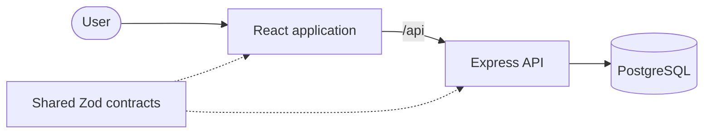

# FitTrack


FitTrack is a full-stack workout planning and tracking application. Users can maintain a personal exercise library, build ordered workouts, record live sessions, compare previous performance, and correct completed training records through an explicit lifecycle.

This project is built as a production-oriented TypeScript monorepo. Its focus is not only the user interface, but also contract safety, authorization, transactional consistency, isolated integration testing, container delivery, and maintainable feature boundaries.

> **Status:** the core workout workflow is complete. Current work focuses on reliability, documentation, delivery, and operational readiness rather than adding unrelated features. A public demo is not available yet; the complete application runs locally with Docker Compose.

## Engineering highlights

- **Shared runtime contracts:** frontend and backend consume the same strict Zod request and response schemas from `@fit-track/shared`.
- **Defence at both boundaries:** the backend authoritatively validates untrusted input, while the frontend validates real API responses before using them.
- **Ownership by default:** every protected query is scoped to the authenticated user, including nested workout exercises and sets.
- **Transactional ordering:** workout exercise positions and set numbers remain contiguous after concurrent moves and deletions.
- **Recoverable workout lifecycle:** sessions can be started, cancelled, completed, reopened for corrections, and safely deleted.
- **Real integration environment:** Supertest exercises the exported Express application against migrated PostgreSQL, not an in-memory database.
- **Defensive HTTP defaults:** HTTP-only cookies, CSRF origin checks, restricted credentialed CORS, Helmet, payload limits, and rate limiting.
- **Operational lifecycle:** separate liveness/readiness checks, graceful shutdown, append-only migrations, non-root containers, immutable image tags, SBOM, and build provenance.

## Product capabilities

- Registration, login, logout, and session restoration
- Personal exercise library with archive and restore
- Workout creation, editing, ordering, and deletion
- Live workout sessions with reps, weight, duration, notes, and set completion
- Previous-performance context for each exercise
- Explicit session cancellation and completed-workout reopening
- Responsive protected routes and an accessible public landing page

## Workout lifecycle


A user can have only one active workout. **Cancel** returns it to draft and clears completion marks without discarding entered set values. **Reopen** returns a completed workout to the active session while preserving its recorded data. Any owned workout can be deleted from every lifecycle state together with its nested exercises and sets.

## Architecture



```text
fit-track/
├── frontend/          React single-page application organized by feature
├── backend/           Express API, domain services, tests, and Prisma layer
│   └── prisma/        Database schema and append-only migrations
├── shared/            Framework-independent Zod schemas and TypeScript contracts
├── docs/              Architecture, testing, and release documentation
├── compose.dev.yaml   Complete local development stack
└── compose.test.yaml  Isolated verification stack with temporary PostgreSQL
```

The React application sends `/api` requests to the Express API, which persists data in PostgreSQL. Shared Zod contracts keep both applications aligned at the HTTP boundary; API responses return along the same path.

Frontend code is organized around user-facing features, while reusable layout and UI primitives remain outside feature modules. Large areas gain subdirectories only when they represent a meaningful responsibility.

Read [Architecture and design decisions](docs/architecture.md) for request flow, backend layers, data model, security boundaries, and trade-offs.

## Technology stack

| Area           | Technologies                                                                 |
| -------------- | ---------------------------------------------------------------------------- |
| Frontend       | React 19, TypeScript, Vite, React Router, Tailwind CSS, Zod                  |
| Backend        | Node.js 24, Express 5, TypeScript, Prisma ORM, Zod                           |
| Database       | PostgreSQL 17                                                                |
| Authentication | JWT in HTTP-only cookies, bcrypt password hashing                            |
| Testing        | Vitest, Supertest, Testing Library, MSW, axe-core                            |
| Delivery       | Docker Compose, multi-stage containers, GitHub Actions, GHCR, Release Please |

## Quick start

### Requirements

- Docker with Docker Compose
- Git

```bash
git clone https://github.com/jakobzagar/Fit-Track.git
cd Fit-Track
cp .env.dev.example .env.dev
```

Replace the example passwords and `JWT_SECRET` in `.env.dev`, then start the application:

```bash
docker compose --env-file .env.dev -f compose.dev.yaml up --build
```

| Service    | Address                                        |
| ---------- | ---------------------------------------------- |
| Frontend   | [http://localhost:5173](http://localhost:5173) |
| API        | [http://localhost:3001](http://localhost:3001) |
| PostgreSQL | `127.0.0.1:5433`                               |

The migration container applies committed migrations before the backend starts. The frontend sends `/api` requests through its development proxy.

Stop the stack without deleting the database volume:

```bash
docker compose --env-file .env.dev -f compose.dev.yaml down --remove-orphans
```

For pgAdmin, configure its values in `.env.dev` and start the optional tools profile:

```bash
docker compose --env-file .env.dev -f compose.dev.yaml --profile tools up --build
```

Instructions for running Node.js and PostgreSQL directly are available in [Architecture and design decisions](docs/architecture.md#local-development-without-docker).

## Verification

Run the fast workspace verification before opening a pull request:

```bash
npm run verify
```

Run the complete isolated suite for backend behavior, persistence, authorization, concurrency, security middleware, or migrations:

```bash
npm run test:docker
```

| Layer               | Responsibility                                                                   |
| ------------------- | -------------------------------------------------------------------------------- |
| Shared contracts    | Validation boundaries, normalization, and strict response shapes                 |
| Backend unit        | Middleware, transaction retry logic, cookies, and graceful shutdown              |
| Backend integration | HTTP behavior against migrated PostgreSQL, ownership, lifecycle, and concurrency |
| Frontend            | User interactions, state transitions, API failures, routing, and accessibility   |

See [Testing strategy](docs/testing.md) for suite boundaries, database safety, commands, and test conventions.

## Design decisions

- **HTTP-only cookies over browser storage:** JavaScript cannot read the authentication token; same-origin state-changing requests are additionally protected by CSRF origin checks.
- **Runtime schemas over TypeScript-only contracts:** compile-time types cannot validate JSON received over the network, so successful and error responses are parsed at the client boundary.
- **A real relational test database:** ownership, foreign keys, cascades, uniqueness, ordering, and transaction conflicts depend on PostgreSQL behavior.
- **Archive exercises, preserve history:** an exercise referenced by previous workouts remains available to historical records even when removed from the active library.
- **Explicit lifecycle corrections:** completed workouts remain read-only until the user deliberately reopens them, making accidental history changes less likely.
- **Separate migration artifact:** schema changes run once before the matching backend revision rather than from every application replica.

More context and accepted trade-offs are documented in [Architecture and design decisions](docs/architecture.md#design-decisions-and-trade-offs).

## Security and operational boundaries

The API restricts credentialed CORS to the configured frontend origin, checks CSRF origins for state-changing requests, limits JSON bodies to 100 KB, uses Helmet security headers, and returns sanitized unexpected errors. Production cookies are secure and HTTP-only.

The current rate limiter uses process-local memory and is suitable for the present single-process runtime. Multiple backend processes require a shared store if limits must be global. Production logs currently use standard output and error but are not yet structured or correlated by request ID.

The repository contains optimized production containers and image-publishing automation, but it does not claim that platform concerns such as HTTPS termination, managed secrets, backups, monitoring, or deployment are already implemented.

## Delivery

Successful commits on `main` publish three multi-platform images from the same tested revision:

- `fit-track-backend`
- `fit-track-frontend`
- `fit-track-migration`

Images receive immutable `sha-<commit>` tags, SBOM attestations, and build provenance. Release Please manages product versions and promotes existing images without rebuilding them.

See [Release and container process](docs/release-process.md) for migration ordering, image tags, local workflow checks, and release operations.

## Documentation

- [Architecture and design decisions](docs/architecture.md)
- [Testing strategy](docs/testing.md)
- [Release and container process](docs/release-process.md)

## Author

Created by [Jakob Zagar](https://github.com/jakobzagar) as an independent portfolio project.
