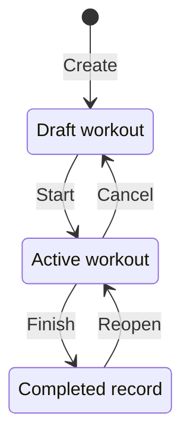
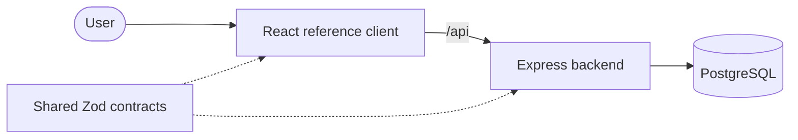

# FitTrack


[](https://github.com/jakobzagar/Fit-Track/actions/workflows/test.yaml)
[](https://github.com/jakobzagar/Fit-Track/releases)

FitTrack is a backend- and delivery-focused TypeScript system for planning and recording workouts. It demonstrates relational data modelling, authorization, transactional lifecycle invariants, PostgreSQL integration testing, containerized delivery, and release automation. A React application serves as the reference client for the complete API workflow.

> **Current state:** the application and its production container artifacts are implemented and verified locally and in CI. A public environment is not deployed yet. AWS infrastructure is the next planned phase and is documented as a plan, not as an existing capability.

## What this project demonstrates

| Focus               | Evidence                                                                                                                     |
| ------------------- | ---------------------------------------------------------------------------------------------------------------------------- |
| Backend design      | Thin Express routes, authoritative domain services, centralized middleware, and Prisma persistence                           |
| Data integrity      | Ownership-scoped queries, relational constraints, append-only migrations, serializable transactions, and retry handling      |
| Security            | HTTP-only cookies, CSRF origin checks, credentialed CORS, payload limits, rate limiting, security headers, and log redaction |
| Verification        | Contract, unit, PostgreSQL integration, concurrency, browser E2E, accessibility, release, and final-container tests          |
| Container delivery  | Non-root multi-stage images, a dedicated migration artifact, digest-pinned smoke tests, SBOM, and build provenance           |
| Release engineering | Protected pull requests, coordinated product versions, exact-digest promotion, and Release Please                            |
| Cloud direction     | An explicit AWS gap analysis and deployment plan without presenting proposed infrastructure as implemented                   |
| Reference client    | A React interface that exercises authentication, lifecycle transitions, validation failures, and persisted state             |

### Recommended technical review path

1. Read the [workout lifecycle and data model](docs/architecture.md#workout-lifecycle).
2. Inspect the [lifecycle service](backend/src/modules/workouts/services/workout-lifecycle.service.ts) and its [concurrency tests](backend/src/modules/workouts/tests/workout-lifecycle-concurrency.integration.test.ts).
3. Review [nested ownership enforcement](backend/src/modules/workouts/workout-exercises/services/owned-workout-resource.loader.ts) and the [authorization integration tests](backend/src/modules/workouts/workout-exercises/tests/workout-exercise.integration.test.ts).
4. Follow the [risk-to-evidence testing map](docs/testing.md#risk-to-evidence-map).
5. Review the [container and release pipeline](docs/release-process.md#pipeline-overview).
6. See the [AWS readiness gap](docs/aws-deployment-plan.md#production-readiness-gap) for work that is deliberately not claimed as complete.

## Engineering case studies

### Enforcing one active workout

**Problem:** two concurrent requests could otherwise start different workouts for the same user.

**Decision:** lifecycle transitions run in serializable transactions, while a partial PostgreSQL unique index provides the final persistence-level invariant. The service translates the expected uniqueness race into stable domain behavior.

**Evidence:** [lifecycle implementation](backend/src/modules/workouts/services/workout-lifecycle.service.ts), [database migration](backend/prisma/migrations/20260815000000_enforce_one_active_workout_per_user/migration.sql), and [concurrency regression tests](backend/src/modules/workouts/tests/workout-lifecycle-concurrency.integration.test.ts).

### Protecting nested workout resources

**Problem:** knowing a valid set or workout-exercise ID must not allow access through a different workout or by another user.

**Decision:** every protected nested mutation resolves the complete ownership chain before changing data. PostgreSQL relations and cascades complement, rather than replace, application authorization.

**Evidence:** [owned-resource loader](backend/src/modules/workouts/workout-exercises/services/owned-workout-resource.loader.ts) and [nested mutation tests](backend/src/modules/workouts/workout-exercises/tests/workout-mutation-constraints.integration.test.ts).

### Verifying the artifact that is promoted

**Problem:** a human-readable image tag can move and therefore cannot prove which content passed runtime verification.

**Decision:** workflows smoke-test the exact digests returned by each build and promote those same digests. A separate migration image makes schema rollout an explicit deployment step.

**Evidence:** [production image action](.github/actions/build-production-images/action.yml), [container smoke script](scripts/smoke/production-containers.sh), and [release policy](docs/release-process.md#image-tags).

## Product behavior

Users can register, maintain a personal exercise library, create ordered workouts, record sets, compare previous performance, and correct completed records through an explicit lifecycle.



A user can have only one active workout. Cancellation preserves entered set values but clears completion marks. Reopening preserves a completed record while making the correction deliberate. Any owned workout can be deleted together with its nested exercises and sets.

## System overview



| Area             | Technologies                                                  |
| ---------------- | ------------------------------------------------------------- |
| Backend          | Node.js 24, Express 5, TypeScript, Prisma ORM, Zod, Pino      |
| Database         | PostgreSQL 17                                                 |
| Delivery         | Docker Compose, GitHub Actions, GHCR, Release Please          |
| Testing          | Vitest, Supertest, Playwright, Testing Library, MSW, axe-core |
| Reference client | React 19, Vite, React Router, Tailwind CSS                    |
| Shared contracts | Framework-independent Zod schemas and inferred types          |

The backend is the authoritative trust boundary. Shared contracts keep HTTP request and response shapes aligned, while PostgreSQL constraints protect invariants that must survive concurrent requests. See [Architecture and design decisions](docs/architecture.md) for request flow, Module ownership, security controls, runtime behavior, and accepted trade-offs.

## Run locally

### Requirements

- Docker with Docker Compose
- Git

```bash
git clone https://github.com/jakobzagar/Fit-Track.git
cd Fit-Track
cp .env.dev.example .env.dev
```

Replace the example passwords and `JWT_SECRET`, then start the complete stack:

```bash
npm run dev:docker
```

| Process    | Address                                        |
| ---------- | ---------------------------------------------- |
| Frontend   | [http://localhost:5173](http://localhost:5173) |
| Backend    | [http://localhost:3001](http://localhost:3001) |
| PostgreSQL | `127.0.0.1:5433`                               |

The one-off migration container must succeed before the backend starts. Stop the stack without deleting its database volume with `npm run dev:docker:down`. Direct-process setup and environment ownership are documented in [architecture](docs/architecture.md#environment-configuration).

## Verification

```bash
npm run verify      # lint, types, formatting, fast tests, release checks, builds
npm run test:docker # migrated PostgreSQL integration and concurrency tests
npm run test:e2e    # critical browser journeys against the real backend and database
```

Pull requests additionally build and exercise the final backend, migration, and Nginx images together. The complete responsibility map, safety guards, and diagnostic commands belong in the [testing strategy](docs/testing.md).

## Current operational limits

- There is no public deployment or AWS infrastructure definition yet.
- HTTPS termination, managed secrets, backups, monitoring, and deployment automation are not configured.
- Rate-limit counters are process-local and are not global across backend replicas.
- Structured logs are written to standard output, but no external collection or alerting destination is configured.

These are documented gaps, not hidden production claims. The intended next phase is described in the [AWS deployment plan](docs/aws-deployment-plan.md).

## Documentation

- [Domain language](CONTEXT.md)
- [Architecture and design decisions](docs/architecture.md)
- [Testing strategy](docs/testing.md)
- [Release and container process](docs/release-process.md)
- [AWS deployment plan](docs/aws-deployment-plan.md)

## Author

Designed and implemented by [Jakob Zagar](https://github.com/jakobzagar) as an independent backend, delivery, and cloud-learning portfolio project.
