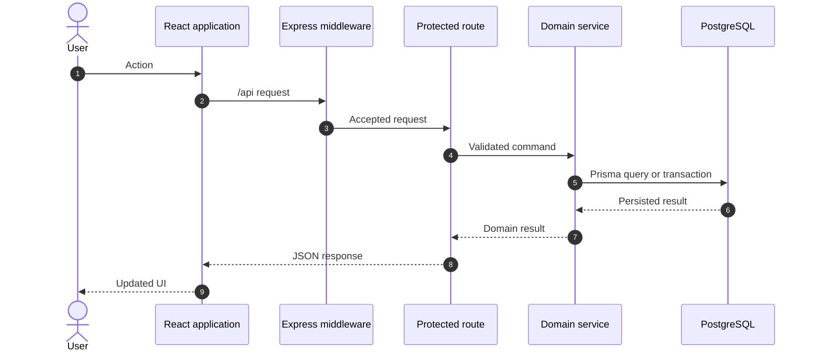
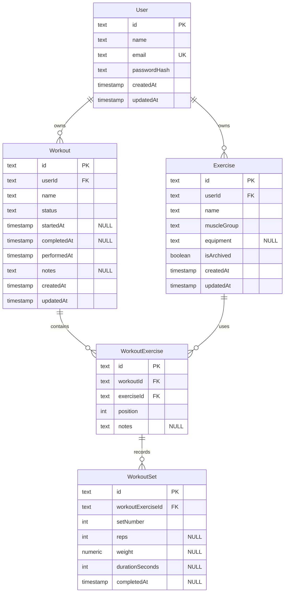

# Architecture and design decisions

This document explains how FitTrack is organized, where trust boundaries sit, and why the project uses its current design. For setup and the product overview, start with the [main README](../README.md).

## Workspace responsibilities

| Workspace  | Responsibility                                                                               |
| ---------- | -------------------------------------------------------------------------------------------- |
| `frontend` | React application, user interactions, client state, routing, and API response validation     |
| `backend`  | Authentication, authorization, input validation, domain rules, transactions, and persistence |
| `shared`   | Framework-independent Zod schemas and TypeScript contracts used by both applications         |

Shared contracts describe data crossing the HTTP boundary. They do not contain React, Express, or Prisma behavior, keeping the package portable and preventing infrastructure details from leaking into domain contracts.

## Request flow



The diagram shows the successful path for a protected feature request. Express runs these layers in order:

| Scope           | Middleware                                                       | Responsibility                                                                      |
| --------------- | ---------------------------------------------------------------- | ----------------------------------------------------------------------------------- |
| Application     | Helmet → CORS → general rate limiter                             | Security headers, allowed browser origin, request throttling                        |
| Application     | JSON and URL-encoded parsers → cookie parser → CSRF origin check | Parse bodies up to 100 KB, read the auth cookie, protect state-changing requests    |
| Protected route | JWT authentication → Zod validation → controller                 | Establish the user identity, validate path/query/body data, translate HTTP concerns |
| Service         | Ownership rules → Prisma transaction when required               | Enforce domain rules and persist a consistent result                                |
| Final handler   | Not-found middleware → error middleware                          | Return stable responses for unknown routes and failures                             |

Public health routes and login or registration omit JWT authentication. Health checks also bypass the general limiter so runtime probes remain independent of client traffic. Login and registration use their own endpoint rate limiters in addition to the general limiter.

Shared Zod schemas validate input at the API boundary and successful responses at the frontend boundary. Inside the API, routes define middleware, controllers translate HTTP concerns, services contain lifecycle, ownership, and transaction rules, and Prisma owns persistence. The final not-found and error middleware convert unmatched routes, expected `AppError` instances, Prisma errors, malformed JSON, and unexpected failures into stable HTTP responses.

## Feature organization

Backend modules live under `backend/src/modules/`. Every existing responsibility uses a predictable directory such as `controllers/`, `middleware/`, `routes/`, `services/`, `policies/`, or `tests/`, even when that directory currently contains one file. Workout lifecycle operations are separated from general workout CRUD because they coordinate status transitions and serializable transactions.

Frontend features live under `frontend/src/features/`. Feature APIs, schemas, hooks, pages, components, styles, types, and local tests stay together in responsibility directories. Reusable primitives live under `frontend/src/components/`, separated into layout and UI responsibilities with tests under their owning component area.

Shared domains follow the same convention with `schemas/` and `tests/` directories while preserving stable public package subpaths such as `@fit-track/shared/workouts`. Directories are created only for responsibilities that exist; entrypoints and conventional configuration files remain at their expected roots.

## PostgreSQL data model

The diagram reflects the persisted PostgreSQL tables. `PK`, `FK`, and `UK` mark primary, foreign, and unique keys; `NULL` marks optional columns.



`WorkoutExercise` is the join table between `Workout` and `Exercise`. It stores the position and notes specific to that workout. `WorkoutSet` belongs to this join table, so recorded values stay attached to a particular workout exercise rather than changing the reusable exercise definition. `WorkoutSet.weight` is `DECIMAL(8,2)`.

The ERD includes every persisted scalar field and relation from the five Prisma models. Prisma relation arrays such as `User.workouts` are represented by the connecting lines rather than repeated as database columns.

Database constraints and indexes:

- `WorkoutStatus` is a PostgreSQL enum: `DRAFT`, `ACTIVE`, or `COMPLETED`, with `DRAFT` as the default;
- `User.email`, `Exercise(userId, name)`, `WorkoutExercise(workoutId, exerciseId)`, `WorkoutExercise(workoutId, position)`, and `WorkoutSet(workoutExerciseId, setNumber)` are unique; a partial unique index additionally allows at most one `ACTIVE` workout per user;
- indexes support `Exercise(userId, isArchived)`, `Workout(userId, performedAt DESC)`, and `WorkoutExercise(exerciseId)`;
- deleting a user cascades to that user's exercises and workouts; deleting a workout cascades to its workout exercises and sets; deleting an exercise referenced by a workout is restricted;
- database checks require positive positions, set numbers, reps, and durations; weight is `0` through `999999.99`; each set has either reps or duration; workout timestamps must match the `DRAFT`, `ACTIVE`, or `COMPLETED` lifecycle state.

Application invariants complement the database rules: protected reads and mutations are scoped to the authenticated owner, while ordering mutations run in serializable transactions with retry handling. Services temporarily move conflicting positions or numbers and then close gaps in a deterministic order.

## Workout lifecycle

| Operation | Required state                | Result      | Preserved data                                             |
| --------- | ----------------------------- | ----------- | ---------------------------------------------------------- |
| Start     | `DRAFT`                       | `ACTIVE`    | Exercises and planned sets                                 |
| Cancel    | `ACTIVE`                      | `DRAFT`     | Set values; completion marks are cleared                   |
| Finish    | `ACTIVE` with a completed set | `COMPLETED` | Full recorded session                                      |
| Reopen    | `COMPLETED`                   | `ACTIVE`    | Original start time, exercises, sets, and completion marks |
| Delete    | Any owned state               | Removed     | Nothing; nested rows cascade                               |

Only one workout may be active for a user. Start and reopen enforce this invariant inside serializable transactions, including concurrent requests; PostgreSQL's partial unique index is the final persistence-level guard.

## Trust and validation boundaries

The frontend provides early validation and useful error presentation, but it is not a security boundary. The backend remains authoritative for:

- request bodies, parameters, and query strings;
- authentication and ownership;
- lifecycle transitions;
- nested-resource relationships;
- transaction and relational constraints.

The frontend separately parses actual JSON responses with shared strict schemas. This detects response drift before malformed data reaches application state.

## Authentication and request security

Authentication uses a signed JWT in an HTTP-only cookie. Production cookies are marked `Secure` and use `SameSite=Lax`. State-changing requests must carry the configured frontend `Origin`, providing explicit CSRF protection in addition to cookie attributes.

`CLIENT_URL` accepts only an HTTP or HTTPS origin. The configuration parser removes an optional trailing slash, then CORS and CSRF checks consume the same normalized value. `DATABASE_URL` must be a valid PostgreSQL URL with a host and database name. Production connections require `sslmode=require`, `verify-ca`, or `verify-full` unless a controlled production-like environment explicitly sets `DATABASE_TLS_MODE=allow-insecure`; the production smoke stack uses that escape hatch only for its temporary local PostgreSQL container.

The Express application also provides:

- Helmet security headers;
- credentialed CORS limited to `CLIENT_URL`;
- 100 KB JSON and form payload limits;
- general, login, and registration rate limiters;
- sanitized unexpected error responses;
- an explicit `TRUST_PROXY_HOPS` count that defaults to no trusted proxy.

The proxy count must match the only network path to the API because Express uses it to determine the client address from `X-Forwarded-For`. The development and production-smoke Compose stacks use one proxy hop; a directly started backend uses zero. Rate-limit counters currently use process memory. A multi-process runtime needs a shared store before treating those counters as global.

## Runtime lifecycle

The backend exposes two health checks:

- `GET /api/health/live` confirms that the process can answer HTTP requests;
- `GET /api/health/ready` confirms that PostgreSQL is reachable and returns `503` otherwise.

On `SIGTERM` or `SIGINT`, the server stops accepting new connections, waits for HTTP connections to close, disconnects Prisma, and exits. A timeout force-closes remaining connections to prevent an indefinitely stuck shutdown.

## Design decisions and trade-offs

### Shared Zod schemas

TypeScript types disappear at runtime. Sharing strict Zod schemas gives both applications the same contract while allowing the backend to reject input and the frontend to reject invalid responses. The trade-off is that contract changes require coordinated workspace builds, which the monorepo and CI pipeline already enforce.

### HTTP-only cookie authentication

Keeping the JWT out of `localStorage` reduces exposure to token theft through JavaScript. Cookie authentication requires explicit CSRF and CORS handling, which the backend tests as part of its security boundary.

### PostgreSQL integration tests

An in-memory substitute would be faster but could not reproduce PostgreSQL constraints, decimal behavior, migrations, or serializable transaction conflicts. Fast unit and frontend tests remain separate so normal feedback is still quick.

### Archived exercises

Archiving removes an exercise from new workout selection without destroying historical references. An archived name remains reserved because exercise names are unique per user. Permanent removal of unused archived exercises is not currently part of the product.

### Explicit workout reopening

Completed sessions are immutable during normal editing. A deliberate reopen action makes corrections possible while keeping accidental changes visible in the user flow. Reopening is rejected while another workout is active.

### Separate migration image

The runtime backend image contains only compiled application files and production dependencies. A separate migration image includes the Prisma tooling and committed migrations. This increases the number of artifacts but makes schema changes an explicit one-off step rather than a side effect of every application start.

## Environment configuration

Environment files are separated by launch mode so Docker and direct-process settings cannot silently override each other:

| Launch mode      | Local file      | Canonical template                 | Consumer                                   |
| ---------------- | --------------- | ---------------------------------- | ------------------------------------------ |
| Docker Compose   | `.env.dev`      | `.env.dev.example`                 | `compose.dev.yaml` interpolation           |
| Direct backend   | `backend/.env`  | `backend/.env.example`             | Backend process through `dotenv`           |
| Direct frontend  | `frontend/.env` | `frontend/.env.example`            | Vite development server and frontend build |
| Automated tests  | None            | Workflow and Compose configuration | Test runners and isolated containers       |
| Production smoke | None            | `compose.production-smoke.yaml`    | Temporary final-image verification stack   |

The standard paths are the complete Compose stack or both directly started applications. Root `.env.dev` is not loaded by direct workspace processes, and application-level `.env` files are not inputs to Compose. If a single application is run separately for debugging, configure that process from its owning file instead of copying settings between files. Actual environment files remain ignored; only their `*.example` templates belong in version control.

The backend passes bounded pool settings directly to the PostgreSQL driver adapter. `DB_POOL_MAX` defaults to `5`, `DB_CONNECTION_TIMEOUT_MS` to `5000`, and `DB_IDLE_TIMEOUT_MS` to `30000`. Deployment capacity must keep `DB_POOL_MAX × maximum backend tasks` below the database connection budget, with headroom for migrations and administration. Production should override these values only after sizing them against the selected database instance.

`TRUST_PROXY_HOPS` must describe the request path, not the deployment environment name. Use `0` for a client connecting directly to Express and `1` when exactly one controlled proxy, such as the development Vite server or production Nginx, sits in front of it. Increase it only after adding another trusted proxy hop and verifying the complete path.

## Local development without Docker

Requirements are Node.js 24.18 or newer, npm 11 or newer, and a reachable PostgreSQL server.

```bash
npm ci
cp backend/.env.example backend/.env
cp frontend/.env.example frontend/.env
```

Set a valid PostgreSQL `DATABASE_URL`, strong `JWT_SECRET`, matching origin-only `CLIENT_URL`, and `TRUST_PROXY_HOPS=0` in `backend/.env`. Apply migrations from the repository root:

```bash
npm exec --workspace @fit-track/backend -- prisma migrate deploy
```

Run the applications in separate terminals:

```bash
npm run dev:backend
npm run dev:frontend
```

The frontend requests relative `/api` paths. Vite forwards them to `API_PROXY_TARGET`, which defaults to the locally running backend.

## Known operational boundaries

- Application logs use standard output and error but are not yet structured or correlated by request ID.
- The repository publishes containers but does not include a platform deployment definition.
- Production containers are not started together by the normal fast verification command.
- HTTPS termination, managed secrets, backups, monitoring, and deployment remain runtime responsibilities.
