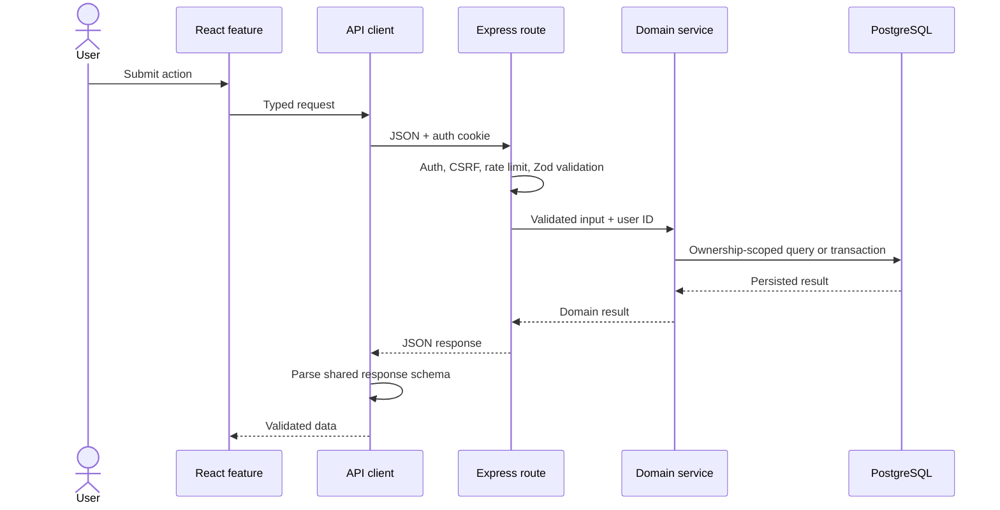
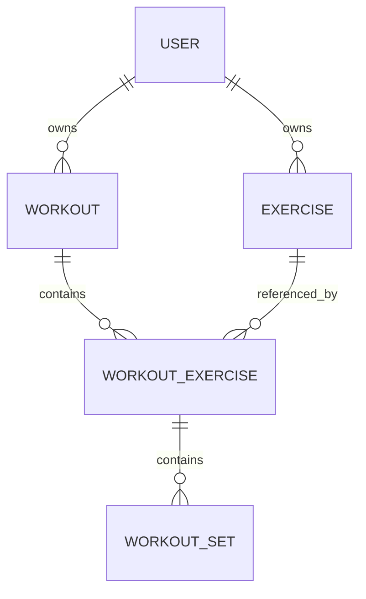

# Architecture and design decisions

This document explains how FitTrack is organized, where trust boundaries sit, and why the project uses its current design. For setup and the product overview, start with the [main README](../README.md).

## Workspace responsibilities

| Workspace  | Responsibility                                                                               |
| ---------- | -------------------------------------------------------------------------------------------- |
| `frontend` | React application, user interactions, client state, routing, and API response validation     |
| `backend`  | Authentication, authorization, input validation, domain rules, transactions, and persistence |
| `shared`   | Framework-independent Zod schemas and TypeScript contracts used by both applications         |

Shared contracts describe data crossing the HTTP boundary. They do not contain React, Express, or Prisma behavior, keeping the package portable and preventing infrastructure details from leaking into domain contracts.

## Request flow



Routes define middleware and validation. Controllers translate HTTP concerns. Services contain lifecycle, ownership, and transactional rules. Prisma owns persistence and database relations.

## Feature organization

Backend modules live under `backend/src/modules/`. Small modules remain flat; larger modules use meaningful boundaries such as `services/`, `policies/`, and `tests/`. Workout lifecycle operations are separated from general workout CRUD because they coordinate status transitions and serializable transactions.

Frontend features live under `frontend/src/features/`. Feature APIs, schemas, hooks, pages, components, and local tests stay together. Reusable primitives live under `frontend/src/components/`, separated into layout and UI responsibilities.

This structure optimizes navigation without forcing every feature into an identical template.

## Data model and invariants



Important relational rules include:

- exercise names are unique per user;
- an exercise can appear only once in a workout;
- exercise positions are unique within a workout;
- set numbers are unique within a workout exercise;
- deleting a workout cascades to its workout exercises and sets;
- deleting an exercise referenced by workout history is restricted;
- protected reads and mutations are always scoped to the authenticated owner.

Ordering mutations run in serializable transactions with retry handling. Services temporarily move conflicting positions or numbers and then close gaps in a deterministic order.

## Workout lifecycle

| Operation | Required state                | Result      | Preserved data                                             |
| --------- | ----------------------------- | ----------- | ---------------------------------------------------------- |
| Start     | `DRAFT`                       | `ACTIVE`    | Exercises and planned sets                                 |
| Cancel    | `ACTIVE`                      | `DRAFT`     | Set values; completion marks are cleared                   |
| Finish    | `ACTIVE` with a completed set | `COMPLETED` | Full recorded session                                      |
| Reopen    | `COMPLETED`                   | `ACTIVE`    | Original start time, exercises, sets, and completion marks |
| Delete    | Any owned state               | Removed     | Nothing; nested rows cascade                               |

Only one workout may be active for a user. Start and reopen enforce this invariant inside serializable transactions, including concurrent requests.

## Trust and validation boundaries

The frontend provides early validation and useful error presentation, but it is not a security boundary. The backend remains authoritative for:

- request bodies, parameters, and query strings;
- authentication and ownership;
- lifecycle transitions;
- nested-resource relationships;
- transaction and relational constraints.

The frontend separately parses actual JSON responses with shared strict schemas. This detects response drift before malformed data reaches application state.

## Authentication and request security

Authentication uses a signed JWT in an HTTP-only cookie. Production cookies are marked `Secure` and use `SameSite=Lax`. State-changing requests must carry the configured frontend `Origin`, providing explicit CSRF protection in addition to cookie attributes.

The Express application also provides:

- Helmet security headers;
- credentialed CORS limited to `CLIENT_URL`;
- 100 KB JSON and form payload limits;
- general, login, and registration rate limiters;
- sanitized unexpected error responses;
- one trusted reverse-proxy hop in production.

Rate-limit counters currently use process memory. A multi-process runtime needs a shared store before treating those counters as global.

## Runtime lifecycle

The backend exposes two health checks:

- `GET /api/health/live` confirms that the process can answer HTTP requests;
- `GET /api/health/ready` confirms that PostgreSQL is reachable and returns `503` otherwise.

On `SIGTERM` or `SIGINT`, the server stops accepting new connections, waits for HTTP connections to close, disconnects Prisma, and exits. A timeout force-closes remaining connections to prevent an indefinitely stuck shutdown.

## Design decisions and trade-offs

### Shared Zod schemas

TypeScript types disappear at runtime. Sharing strict Zod schemas gives both applications the same contract while allowing the backend to reject input and the frontend to reject invalid responses. The trade-off is that contract changes require coordinated workspace builds, which the monorepo and CI pipeline already enforce.

### HTTP-only cookie authentication

Keeping the JWT out of `localStorage` reduces exposure to token theft through JavaScript. Cookie authentication requires explicit CSRF and CORS handling, which the backend tests as part of its security boundary.

### PostgreSQL integration tests

An in-memory substitute would be faster but could not reproduce PostgreSQL constraints, decimal behavior, migrations, or serializable transaction conflicts. Fast unit and frontend tests remain separate so normal feedback is still quick.

### Archived exercises

Archiving removes an exercise from new workout selection without destroying historical references. An archived name remains reserved because exercise names are unique per user. Permanent removal of unused archived exercises is not currently part of the product.

### Explicit workout reopening

Completed sessions are immutable during normal editing. A deliberate reopen action makes corrections possible while keeping accidental changes visible in the user flow. Reopening is rejected while another workout is active.

### Separate migration image

The runtime backend image contains only compiled application files and production dependencies. A separate migration image includes the Prisma tooling and committed migrations. This increases the number of artifacts but makes schema changes an explicit one-off step rather than a side effect of every application start.

## Local development without Docker

Requirements are Node.js 24.18 or newer, npm 11 or newer, and a reachable PostgreSQL server.

```bash
npm ci
cp backend/.env.example backend/.env
cp frontend/.env.example frontend/.env
```

Set a valid `DATABASE_URL`, strong `JWT_SECRET`, and matching `CLIENT_URL` in `backend/.env`. Apply migrations from the repository root:

```bash
npm exec --workspace @fit-track/backend -- prisma migrate deploy
```

Run the applications in separate terminals:

```bash
npm run dev:backend
npm run dev:frontend
```

The frontend requests relative `/api` paths. Vite forwards them to `API_PROXY_TARGET`, which defaults to the locally running backend.

## Known operational boundaries

- Application logs use standard output and error but are not yet structured or correlated by request ID.
- The repository publishes containers but does not include a platform deployment definition.
- Production containers are not started together by the normal fast verification command.
- HTTPS termination, managed secrets, backups, monitoring, and deployment remain runtime responsibilities.
