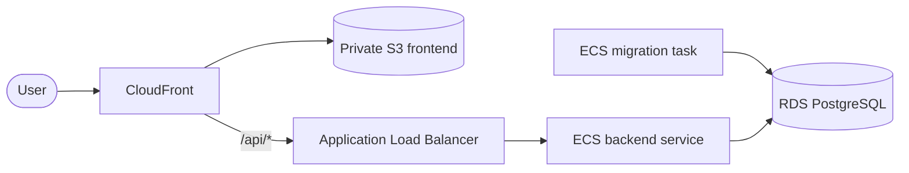

# AWS deployment plan

This document records FitTrack's current production state and the planned AWS architecture. AWS infrastructure is not implemented in the repository yet.

## Current state

There is no live production environment or AWS infrastructure definition yet. The repository currently publishes matching backend, migration, and Nginx frontend images to GHCR from one verified Git SHA. Their publication rules belong in the [release process](release-process.md), runtime behavior in [architecture](architecture.md), and verification coverage in the [testing strategy](testing.md).

HTTPS, DNS, secrets, networking, monitoring, backups, and AWS deployment automation still need to be configured before production launch.

## Planned AWS architecture

The intended layout is:

- a private S3 bucket stores the built React frontend;
- CloudFront serves the frontend, HTTPS, SPA routes, security headers, and cache policies;
- `/api/*` requests are routed through an Application Load Balancer to the ECS backend service;
- ECS backend tasks run without public IP addresses in private application subnets;
- RDS PostgreSQL runs without public access in private database subnets;
- one ECS migration task runs before each matching backend revision;
- secrets are injected at runtime rather than stored in images or the repository.

The VPC should span at least two Availability Zones. The load balancer uses public subnets, while ECS and RDS use private subnets. Private ECS tasks need controlled outbound access for image pulls, logs, and secrets.

The planned static frontend replaces the Nginx frontend container in AWS. Until that path exists and is tested, Nginx remains the repository's verified frontend artifact. AWS deployment must preserve the existing [migration ordering and readiness gate](release-process.md#migration-ordering).

Exact task sizes, replica counts, database capacity, backups, and infrastructure-as-code remain future decisions. They must be selected and verified when the AWS environment is implemented, not described as current repository capabilities.
