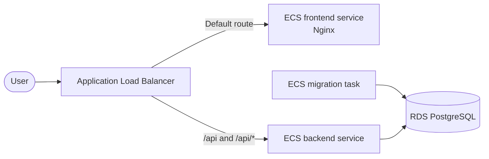

# AWS deployment plan

This document records FitTrack's current production state and the planned AWS architecture. AWS infrastructure is not implemented in the repository yet.

## Current state

There is no live production environment or AWS infrastructure definition yet. The repository currently publishes matching backend, migration, and Nginx frontend images to GHCR from one verified Git SHA. Their publication rules belong in the [release process](release-process.md), runtime behavior in [architecture](architecture.md), and verification coverage in the [testing strategy](testing.md).

HTTPS, DNS, secrets, networking, monitoring, backups, and AWS deployment automation still need to be configured before production launch.

## Production-readiness gap

| Capability            | Verified today                                                                                | Required before AWS launch                                                    |
| --------------------- | --------------------------------------------------------------------------------------------- | ----------------------------------------------------------------------------- |
| Application artifacts | Multi-platform backend, frontend, and migration images published from one tested Git revision | Import or publish artifacts to the selected AWS delivery path                 |
| Database changes      | Append-only Prisma migrations and a dedicated one-off migration image                         | RDS instance, backup policy, restore test, and migration task orchestration   |
| Runtime health        | Separate liveness/readiness checks and graceful shutdown                                      | ECS health checks, deployment rollback policy, and capacity settings          |
| End-to-end behavior   | Critical Chromium journeys against the real API and an isolated migrated PostgreSQL database  | Repeat the critical journeys against the deployed AWS entry point             |
| Security              | Application-level cookies, CSRF, CORS, headers, limits, and log redaction                     | TLS, managed secrets, IAM roles, private networking, and security-group rules |
| Observability         | Structured request-correlated logs on standard output                                         | Central log retention, metrics, alarms, dashboards, and incident ownership    |
| Frontend delivery     | Verified Nginx container with explicit security and cache headers                             | Frontend ECS service, ALB target group, health check, and capacity settings   |

This table is intentionally a gap analysis, not a claim that planned infrastructure already exists.

## Planned AWS architecture

The intended layout is:

- a public Application Load Balancer terminates HTTPS and is the single application entry point;
- its default listener rule forwards browser and SPA requests to the frontend ECS service running the existing Nginx image;
- higher-priority `/api` and `/api/*` rules forward API requests directly to the backend ECS service;
- frontend and backend ECS tasks run without public IP addresses in private application subnets;
- RDS PostgreSQL runs without public access in private database subnets;
- one ECS migration task runs before each matching backend revision;
- secrets are injected at runtime rather than stored in images or the repository.

The VPC should span at least two Availability Zones. The load balancer uses public subnets, while both ECS services and RDS use private subnets. Each ECS service has its own target group and health check. Private ECS tasks need controlled outbound access for image pulls, logs, and secrets.

Keeping the verified Nginx image avoids introducing a second static-serving Implementation for AWS. Its SPA fallback, browser security headers, and cache policy therefore remain part of the deployed frontend behavior. AWS deployment must also preserve the existing [migration ordering and readiness gate](release-process.md#migration-ordering).

Exact task sizes, replica counts, database capacity, backups, and infrastructure-as-code remain future decisions. They must be selected and verified when the AWS environment is implemented, not described as current repository capabilities.
