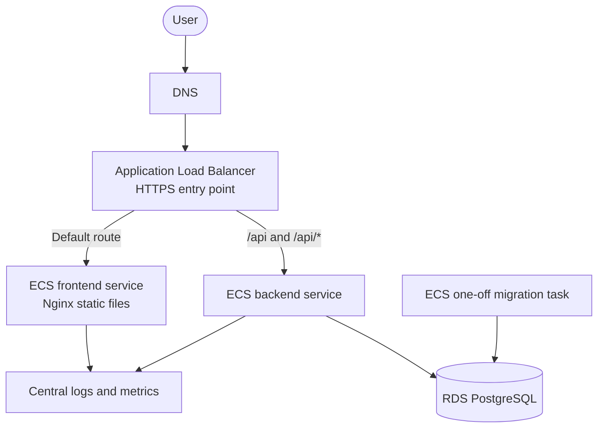

# AWS deployment plan

This document defines the next learning and implementation phase for FitTrack: deploying the existing backend and container artifacts on AWS with infrastructure as code. None of the AWS resources described below exist in this repository yet.

The goal is not to collect cloud services. The goal is to demonstrate a reproducible deployment, least-privilege access, safe database migration ordering, observable runtime behavior, and recovery from a failed application rollout.

## Current state

The repository currently provides:

- matching backend, migration, and Nginx frontend images built from one Git revision;
- exact-digest smoke verification before moving image tags;
- append-only Prisma migrations in a dedicated one-off image;
- separate backend liveness and PostgreSQL-dependent readiness checks;
- structured, redacted logs on standard output;
- graceful backend shutdown;
- critical browser journeys against an isolated migrated PostgreSQL database.

There is no live environment or AWS infrastructure definition. HTTPS, DNS, IAM, managed secrets, networking, database backups, centralized observability, deployment orchestration, and cloud recovery have not been verified.

## Portfolio objective

The AWS phase should provide evidence for these backend, DevOps, and cloud responsibilities:

| Responsibility         | Evidence to produce                                                                                   |
| ---------------------- | ----------------------------------------------------------------------------------------------------- |
| Infrastructure as code | Reviewed Terraform plans and reproducible environment creation                                        |
| Workload identity      | GitHub Actions assumes a restricted AWS role through OIDC without stored AWS access keys              |
| Network isolation      | Public traffic enters through one load balancer; application tasks and PostgreSQL remain private      |
| Secret handling        | Runtime credentials come from a managed secret store rather than images, source, or workflow output   |
| Safe delivery          | A matching migration task succeeds before backend rollout; unhealthy revisions do not receive traffic |
| Artifact integrity     | ECS task definitions use exact image digests from the verified release                                |
| Observability          | Central logs, useful metrics, actionable alarms, and retained deployment evidence                     |
| Recovery               | A failed rollout and a PostgreSQL restore procedure are rehearsed and documented                      |

## Planned topology

The intended request path is:

- a public Application Load Balancer terminates HTTPS;
- its default rule forwards browser and SPA requests to the frontend target group;
- higher-priority `/api` and `/api/*` rules forward API requests directly to the backend target group;
- frontend and backend tasks run in private application subnets without public IP addresses;
- PostgreSQL runs privately and accepts connections only from the backend and migration tasks;
- a one-off migration task must succeed before the matching backend revision is deployed;
- the backend receives exactly one trusted proxy hop from the load balancer.

The current Nginx image assumes an upstream named `backend:3001` because local and production-smoke Compose use Nginx as the API proxy. Separate AWS services do not automatically provide that hostname. Before AWS deployment, the frontend artifact must either use an AWS-specific static-serving configuration without the unused API proxy or receive deliberate service discovery. The planned direct ALB-to-backend route favors the first option; it must preserve the existing SPA fallback, security headers, cache policy, non-root runtime, port, and health endpoint.

## Production-readiness gap

| Capability            | Verified today                                                              | Required before AWS launch                                                               |
| --------------------- | --------------------------------------------------------------------------- | ---------------------------------------------------------------------------------------- |
| Application artifacts | Multi-platform images from one tested Git revision                          | Make exact verified digests available to task definitions                                |
| Database changes      | Append-only migrations and a dedicated migration image                      | RDS, backups, restore rehearsal, and a deployment gate around the one-off migration task |
| Runtime health        | Separate liveness/readiness and graceful shutdown                           | ECS container health checks, target-group health checks, rollback policy, and capacity   |
| End-to-end behavior   | Critical Chromium journeys against the real backend and isolated PostgreSQL | Run a post-deployment journey against the environment entry point                        |
| Security              | Application cookies, CSRF, CORS, request limits, headers, and redacted logs | TLS, managed secrets, restricted IAM, private networking, and security-group rules       |
| Observability         | Structured request-correlated logs on standard output                       | Retained central logs, dashboards, alarms, and an alert destination                      |
| Frontend delivery     | Verified Nginx behavior for the current Compose topology                    | Static-only AWS Nginx configuration or deliberate service discovery                      |
| Deployment recovery   | Exact-digest release artifacts and backend readiness                        | Automated failed-rollout handling plus a tested operator procedure                       |

This table is a gap analysis, not a claim that planned infrastructure is complete.

## Planned implementation stages

### 1. Terraform foundation

- choose a remote, encrypted Terraform state backend and locking strategy;
- define provider and tool versions;
- create environment-specific configuration without copying complete stacks;
- make `terraform fmt`, validation, and plan review part of the pull-request workflow;
- keep apply permissions outside untrusted pull-request execution.

### 2. Network and identity

- create a multi-Availability-Zone VPC layout with public load-balancer and private application/database subnets;
- restrict security groups to the required ALB → frontend/backend and backend/migration → PostgreSQL paths;
- configure GitHub OIDC and separate least-privilege plan/deploy roles;
- define ECS execution and task roles independently.

### 3. Database and secrets

- provision private RDS PostgreSQL with encryption, explicit backup retention, deletion protection, and a final-snapshot policy;
- place application and migration credentials in a managed secret store;
- size backend connection pools against the maximum task count and database connection budget;
- verify encrypted database connections and rehearse a restore before calling the environment production-ready.

### 4. Runtime services

- define exact-digest task definitions for frontend, backend, and migration workloads;
- configure container health checks explicitly in ECS rather than relying only on Dockerfile metadata;
- route both `/api` and `/api/*` to the backend and default traffic to the frontend;
- set backend origin, proxy trust, pool, and logging configuration for the real request path;
- start with explicit task counts and scaling limits rather than undocumented defaults.

### 5. Deployment workflow

1. select the three verified digests from one release;
2. run the matching migration task and wait for a successful exit code;
3. stop the deployment immediately if migration fails;
4. register and deploy the backend task definition;
5. wait for readiness and healthy load-balancer targets;
6. deploy the frontend when required;
7. run a critical post-deployment check against the public entry point;
8. retain the deployed revision and result as release evidence.

Database migrations must remain backward-compatible with the previous backend revision because an application rollback cannot automatically reverse an applied schema migration.

### 6. Observability and recovery

- retain structured application and platform logs for a defined period;
- alarm on missing healthy targets, elevated server errors, failed deployments, resource saturation, and database capacity risks;
- record a clear diagnostic path from an alarm to request-correlated logs;
- rehearse an unhealthy backend rollout, task replacement, secret rotation, and database restore;
- document measured recovery results rather than promising untested availability.

## Environment strategy

Use the same Terraform Modules and container artifacts for staging and production, with environment-specific inputs for names, capacity, retention, domains, and protection settings. Staging exists to rehearse migrations, deployment behavior, and infrastructure changes before production; it should not become a separate architecture.

Cost-sensitive development may use smaller capacity or create resources only when needed. Production safeguards such as deletion protection, retained backups, and restricted apply permissions must not be weakened merely to make both environments textually identical.

## Definition of AWS-ready

FitTrack should be described as deployed on AWS only after all of the following are true:

- Terraform can reproduce the intended environment from reviewed configuration;
- HTTPS serves the reference client and both `/api` and `/api/*` reach the backend correctly;
- ECS runs exact verified image digests and reports explicit container and target health;
- secrets are absent from source, images, Terraform output, and long-lived GitHub credentials;
- a matching migration is required to succeed before backend rollout;
- central logs and actionable alarms work during an induced failure;
- a failed application revision rolls back without manual image retagging;
- a PostgreSQL restore has been completed successfully in a non-production environment;
- the critical user journey passes against the deployed entry point;
- the real architecture, operating procedure, costs, and remaining limitations are documented.

Until then, the accurate portfolio claim is that FitTrack has production-oriented application artifacts and an explicit AWS implementation plan.
