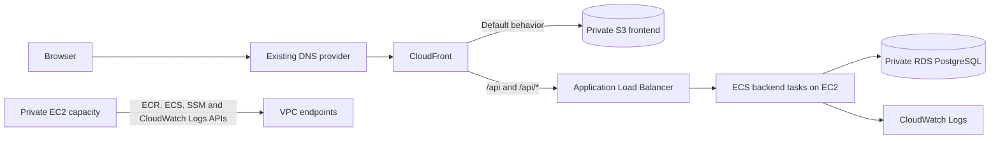

# FitTrack AWS architecture

This document is the single AWS record for FitTrack. It describes the planned architecture and decisions and records implementation state and verification as resources are created.

Planned resources, configured resources, and independently verified settings are clearly distinguished.

## Goals and constraints

- The initial scope is one production environment; staging is deferred.
- DNS remains with the current domain provider; Route 53 is excluded.
- Resources remain private unless public access is required for the ALB or CloudFront.
- Continuously billed resources should not remain idle during learning or long pauses. The app is unavailable when its runtime is stopped or deleted.
- CloudFormation templates are stored under `infra/`; stacks are deployed and inspected through CloudFormation. Actual outcomes and verification are recorded in this document.

## CloudFormation template checks

Install `cfn-lint` with Homebrew on macOS, then run the repository checks before creating or updating a stack:

```bash
brew install cfn-lint
npm run infra:check
```

`infra:check` runs Prettier against the CloudFormation templates and validates them with `cfn-lint` for `eu-central-1`. `cfn-lint` is a local tool and is not installed by `npm install`.

## Target request and data flow


```mermaid
flowchart LR
    Browser[Browser] --> DNS[Existing DNS provider]
    DNS --> CF[CloudFront]
    CF -->|Default behavior| S3[(Private S3 frontend)]
    CF -->|/api and /api/*| ALB[Application Load Balancer]
    ALB --> ECS[ECS backend tasks on EC2]
    ECS --> RDS[(Private RDS PostgreSQL)]
    ECS --> CW[CloudWatch Logs]
    EC2[Private EC2 capacity] -->|ECR, ECS, SSM and CloudWatch Logs APIs| VPCE[VPC endpoints]
```

The static frontend is planned for a private S3 bucket served through CloudFront. CloudFront forwards `/api` and `/api/*` to an internet-facing Application Load Balancer. The ALB routes requests to healthy ECS backend tasks running on EC2 capacity in private application subnets. The backend connects to private RDS PostgreSQL and sends structured logs to CloudWatch. Private EC2 instances use only the VPC endpoints needed for AWS service access; no NAT Gateway is planned. DNS remains with the current provider and points the application hostname to CloudFront.

## Architecture decisions

| Area                 | Current direction                                                                                                                                                          | Status                                                                     |
| -------------------- | -------------------------------------------------------------------------------------------------------------------------------------------------------------------------- | -------------------------------------------------------------------------- |
| Region               | `eu-central-1` (Frankfurt)                                                                                                                                                 | Decided                                                                    |
| Network              | One VPC (`10.20.0.0/20`) across two AZs, with public ALB, private application, and private database subnets in each AZ; one IGW; separate public, app, and DB route tables | CloudFormation template drafted; not deployed; AWS resources not verified  |
| Internet egress      | No NAT Gateway; private ECR, ECS, Systems Manager, CloudWatch Logs, and S3 endpoint templates                                                                              | Templates drafted; not deployed; AWS resources not verified                |
| Network ACL          | Keep the default NACL initially; control workload access with security groups                                                                                              | Planned                                                                    |
| Frontend             | Private S3 origin with CloudFront Origin Access Control                                                                                                                    | Planned                                                                    |
| API entry            | Application Load Balancer (ELB) in public subnets                                                                                                                          | Planned                                                                    |
| Backend              | ECS service using EC2 capacity in private application subnets                                                                                                              | Compute stack drafted; ECS service stack planned; not deployed             |
| Container images     | Private backend and migration repositories; BASIC scan-on-push on `fit-track-prod-*`; immutable SHA/version tags with mutable `main` and `latest` tags                     | ECR template drafted; not deployed; registry settings not verified         |
| Database             | RDS for PostgreSQL, initially Single-AZ, with a DB subnet group spanning both AZs                                                                                          | Planned                                                                    |
| Logs                 | ECS `awslogs` driver sends backend stdout/stderr to CloudWatch Logs; `/fit-track/prod/backend`, 30-day retention, AWS-managed encryption                                   | Logs group and endpoint templates drafted; task definition not yet created |
| DNS                  | Existing provider; no Route 53 hosted zone                                                                                                                                 | Decided                                                                    |
| Environment sequence | Production first; staging deferred                                                                                                                                         | Decided                                                                    |

The CloudFront viewer certificate must use ACM in `us-east-1`; certificates for regional services use the service's region. Record certificate and DNS validation details here when configured.

## Network foundation template

`infra/network/template.yaml` defines the production VPC foundation for stack `fit-track-prod-network`. Tagged resources use `Name: fit-track-prod-<resource>-eu-central-1` and also carry `Environment: prod`, `Project: fit-track`, and `Component: network`. Resources without tags in the table do not expose tag properties in CloudFormation.

| Logical resource IDs                                                                                                                                                                                                             | Name tag(s)                                                                                                        | Configuration and connections                                                                                                                                            |
| -------------------------------------------------------------------------------------------------------------------------------------------------------------------------------------------------------------------------------- | ------------------------------------------------------------------------------------------------------------------ | ------------------------------------------------------------------------------------------------------------------------------------------------------------------------ |
| `FitTrackVpc`                                                                                                                                                                                                                    | `fit-track-prod-vpc-eu-central-1`                                                                                  | CIDR `10.20.0.0/20`; DNS support and hostnames enabled; default tenancy.                                                                                                 |
| `PublicSubnetAz1`, `PublicSubnetAz2`                                                                                                                                                                                             | `fit-track-prod-public-az1-eu-central-1`, `fit-track-prod-public-az2-eu-central-1`                                 | `10.20.0.0/24` in `euc1-az1` and `10.20.1.0/24` in `euc1-az2`; automatic public IPv4 assignment disabled; associated with `PublicRouteTable`.                            |
| `AppSubnetAz1`, `AppSubnetAz2`                                                                                                                                                                                                   | `fit-track-prod-app-az1-eu-central-1`, `fit-track-prod-app-az2-eu-central-1`                                       | `10.20.2.0/24` in `euc1-az1` and `10.20.3.0/24` in `euc1-az2`; automatic public IPv4 assignment disabled; associated with `AppRouteTable`.                               |
| `DbSubnetAz1`, `DbSubnetAz2`                                                                                                                                                                                                     | `fit-track-prod-db-az1-eu-central-1`, `fit-track-prod-db-az2-eu-central-1`                                         | `10.20.4.0/24` in `euc1-az1` and `10.20.5.0/24` in `euc1-az2`; automatic public IPv4 assignment disabled; associated with `DbRouteTable`.                                |
| `InternetGateway`                                                                                                                                                                                                                | `fit-track-prod-igw-eu-central-1`                                                                                  | Attached to `FitTrackVpc` by `InternetGatewayAttachment`.                                                                                                                |
| `PublicRouteTable`, `AppRouteTable`, `DbRouteTable`                                                                                                                                                                              | `fit-track-prod-rt-public-eu-central-1`, `fit-track-prod-rt-app-eu-central-1`, `fit-track-prod-rt-db-eu-central-1` | Public route table is associated with both public subnets and has `PublicDefaultRoute` (`0.0.0.0/0` to the IGW). App and DB route tables have no internet default route. |
| `InternetGatewayAttachment`                                                                                                                                                                                                      | Not taggable                                                                                                       | Attaches the IGW to `FitTrackVpc`.                                                                                                                                       |
| `PublicSubnetAz1RouteTableAssociation`, `PublicSubnetAz2RouteTableAssociation`, `AppSubnetAz1RouteTableAssociation`, `AppSubnetAz2RouteTableAssociation`, `DbSubnetAz1RouteTableAssociation`, `DbSubnetAz2RouteTableAssociation` | Not taggable                                                                                                       | Associate each subnet with its matching public, app, or DB route table.                                                                                                  |
| `PublicDefaultRoute`                                                                                                                                                                                                             | Not taggable                                                                                                       | Depends on `InternetGatewayAttachment` so the default route is created only after the IGW is attached.                                                                   |

The network stack exports AZ IDs, VPC ID and CIDR, all six subnet IDs, and all three route table IDs. Export names use `<stack-name>-<output-name>`; for example, `fit-track-prod-network-AppSubnetAz1Id`. The AZ exports match the AZ IDs assigned to the subnets. Exports are for same-account, same-region stacks, and CloudFormation prevents changing or deleting an export while another stack imports it.

| Output logical ID                                         | Export suffix      | Consumer                                                                             |
| --------------------------------------------------------- | ------------------ | ------------------------------------------------------------------------------------ |
| `AvailabilityZoneAz1Id`, `AvailabilityZoneAz2Id`          | Same as logical ID | Reference to the selected AZ IDs; not currently imported by compute.                 |
| `VpcId`, `VpcCidrBlock`                                   | Same as logical ID | Endpoint and compute stacks import `VpcId`; VPC CIDR is available to future stacks.  |
| `PublicSubnetAz1Id`, `PublicSubnetAz2Id`                  | Same as logical ID | Future ALB stack.                                                                    |
| `AppSubnetAz1Id`, `AppSubnetAz2Id`                        | Same as logical ID | Endpoint and compute stacks.                                                         |
| `DbSubnetAz1Id`, `DbSubnetAz2Id`                          | Same as logical ID | Future RDS subnet group.                                                             |
| `PublicRouteTableId`, `AppRouteTableId`, `DbRouteTableId` | Same as logical ID | Endpoint stack imports `AppRouteTableId`; the others are available to future stacks. |

## VPC endpoints template

`infra/endpoints/template.yaml` defines stack `fit-track-prod-endpoints` with nine interface endpoints in both application subnets and one S3 gateway endpoint on the application route table. The interface endpoint security group has no ingress rules in this stack; compute adds an HTTPS ingress rule from the ECS instance security group. This keeps endpoint access limited to the intended instances and avoids duplicated subnet CIDRs. The interface endpoints create 18 billable endpoint-AZ attachments across two AZs; the three SSM endpoints account for six and the CloudWatch Logs endpoint accounts for two.

| Logical resource ID                                                                    | Physical Name tag                                                                                                                      | Service and placement                                                                                                                       | Tags                                                     |
| -------------------------------------------------------------------------------------- | -------------------------------------------------------------------------------------------------------------------------------------- | ------------------------------------------------------------------------------------------------------------------------------------------- | -------------------------------------------------------- |
| `InterfaceEndpointsSecurityGroup`                                                      | `fit-track-prod-vpc-endpoints-sg-eu-central-1`                                                                                         | Endpoint ENIs' security group. HTTPS ingress is added by `compute` from the ECS instance SG.                                                | `Name`, `Environment`, `Project`, `Component=endpoints`. |
| `EcrApiInterfaceEndpoint`                                                              | `fit-track-prod-vpce-ecr-api-eu-central-1`                                                                                             | `ecr.api`, interface endpoint in both app subnets, private DNS enabled.                                                                     | Shared endpoint tags.                                    |
| `EcrDkrInterfaceEndpoint`                                                              | `fit-track-prod-vpce-ecr-dkr-eu-central-1`                                                                                             | `ecr.dkr`, interface endpoint in both app subnets, private DNS enabled.                                                                     | Shared endpoint tags.                                    |
| `EcsInterfaceEndpoint`, `EcsAgentInterfaceEndpoint`, `EcsTelemetryInterfaceEndpoint`   | `fit-track-prod-vpce-ecs-eu-central-1`, `fit-track-prod-vpce-ecs-agent-eu-central-1`, `fit-track-prod-vpce-ecs-telemetry-eu-central-1` | ECS control plane and agent channels in both app subnets, private DNS enabled.                                                              | Shared endpoint tags.                                    |
| `SsmInterfaceEndpoint`, `SsmMessagesInterfaceEndpoint`, `Ec2MessagesInterfaceEndpoint` | `fit-track-prod-vpce-ssm-eu-central-1`, `fit-track-prod-vpce-ssmmessages-eu-central-1`, `fit-track-prod-vpce-ec2messages-eu-central-1` | Systems Manager and Session Manager channels in both app subnets, private DNS enabled.                                                      | Shared endpoint tags.                                    |
| `CloudWatchLogsInterfaceEndpoint`                                                      | `fit-track-prod-vpce-logs-eu-central-1`                                                                                                | `logs`, interface endpoint in both app subnets, private DNS enabled; endpoint policy allows `logs:CreateLogStream` and `logs:PutLogEvents`. | Shared endpoint tags.                                    |
| `S3GatewayEndpoint`                                                                    | `fit-track-prod-vpce-s3-eu-central-1`                                                                                                  | S3 gateway endpoint associated with `AppRouteTable`; endpoint policy permits ECR image-layer downloads from the regional ECR layer bucket.  | Shared endpoint tags.                                    |

The `Environment` parameter is currently restricted to `prod`. Physical names and the `Environment` tag derive from that parameter. Endpoint resources and their security group are not deployed or AWS-verified.

| Output logical ID                                                                                                                                    | Export suffix           | Consumer                                                                                |
| ---------------------------------------------------------------------------------------------------------------------------------------------------- | ----------------------- | --------------------------------------------------------------------------------------- |
| `EcrApiInterfaceEndpointId`, `EcrDkrInterfaceEndpointId`, `EcsInterfaceEndpointId`, `EcsAgentInterfaceEndpointId`, `EcsTelemetryInterfaceEndpointId` | Same as each logical ID | Operational inspection; no current cross-stack consumer.                                |
| `SsmInterfaceEndpointId`, `SsmMessagesInterfaceEndpointId`, `Ec2MessagesInterfaceEndpointId`                                                         | Same as each logical ID | Operational inspection; no current cross-stack consumer.                                |
| `CloudWatchLogsInterfaceEndpointId`                                                                                                                  | Same as logical ID      | Operational inspection; ECS task logging reaches CloudWatch Logs through this endpoint. |
| `S3GatewayEndpointId`                                                                                                                                | Same as logical ID      | Operational inspection; subnet routing is configured directly in this stack.            |
| `InterfaceEndpointsSecurityGroupId`                                                                                                                  | Same as logical ID      | Imported by compute to add the ECS-instance-only HTTPS ingress rule.                    |

## ECR scanning template

`infra/ecr/template.yaml` defines stack `fit-track-prod-ecr` with backend and migration repositories and configures the regional private registry in `eu-central-1` for BASIC image scanning on push. The `fit-track-${Environment}-*` wildcard covers both repositories; repositories outside that prefix remain on manual scanning.

| Logical resource ID                | Physical name or Name tag               | Configuration and connections                                                                                         | Tags                                                              |
| ---------------------------------- | --------------------------------------- | --------------------------------------------------------------------------------------------------------------------- | ----------------------------------------------------------------- |
| `EcrRegistryScanningConfiguration` | Regional private registry               | `ScanType: BASIC`; `SCAN_ON_PUSH` for repositories matching `fit-track-prod-*`; unmatched repositories remain manual. | Registry scanning configuration is not taggable.                  |
| `EcrBackendRepository`             | `fit-track-prod-backend-eu-central-1`   | Private repo; AES-256 encryption; immutable tags except `main` and `latest`; retain the 10 newest images.             | `Name`, `Environment=prod`, `Project=fit-track`, `Component=ecr`. |
| `EcrMigrationRepository`           | `fit-track-prod-migration-eu-central-1` | Private repo; AES-256 encryption; immutable tags except `main` and `latest`; retain the 10 newest images.             | `Name`, `Environment=prod`, `Project=fit-track`, `Component=ecr`. |

Basic scanning detects operating-system package vulnerabilities. It is the lowest-cost option and avoids Amazon Inspector charges; it does not continuously rescan images or cover application-language packages. Enhanced scanning adds OS and language package findings through Amazon Inspector and can incur Inspector charges. Check the current registry scanning settings in `eu-central-1` before deploying: the CloudFormation resource manages the registry-wide scanning configuration, while the filter limits which repositories get scan-on-push. Repository-level scan-on-push settings are omitted because the registry rule owns scanning behavior. Each repository's lifecycle policy keeps the 10 most recently pushed images and expires older ones; ECR may take up to 24 hours to apply expiration. This limits rollback images to the retained set, including release tags attached to those images. `EmptyOnDelete: true` means deleting this stack deletes all images in both repositories. The stack is not deployed or AWS-verified.

| Output logical ID            | Export suffix      | Consumer                                               |
| ---------------------------- | ------------------ | ------------------------------------------------------ |
| `EcrRegistryId`              | Same as logical ID | Account ID for ECR login and registry identification.  |
| `EcrBackendRepositoryName`   | Same as logical ID | CI push target and future ECS task definition.         |
| `EcrBackendRepositoryUri`    | Same as logical ID | URI prefix for backend image tags or digests.          |
| `EcrBackendRepositoryArn`    | Same as logical ID | IAM repository scope for image pull and publish roles. |
| `EcrMigrationRepositoryName` | Same as logical ID | CI push target and future migration task definition.   |
| `EcrMigrationRepositoryUri`  | Same as logical ID | URI prefix for migration image tags or digests.        |
| `EcrMigrationRepositoryArn`  | Same as logical ID | IAM repository scope for image pull and publish roles. |

## Compute template

`infra/compute/template.yaml` defines stack `fit-track-prod-compute` and creates the ECS cluster and EC2 capacity. It imports VPC and app subnet IDs from `fit-track-prod-network`, plus the interface endpoint security group from `fit-track-prod-endpoints`. The ASG depends on the endpoint ingress rule so instances launch after HTTPS access to private AWS endpoints is available.

| Logical resource ID                            | Physical name or Name tag                                                                           | Configuration and connections                                                                                                                                                                                | Tags                                                                                         |
| ---------------------------------------------- | --------------------------------------------------------------------------------------------------- | ------------------------------------------------------------------------------------------------------------------------------------------------------------------------------------------------------------ | -------------------------------------------------------------------------------------------- |
| `EcsInstanceRole`                              | `fit-track-prod-ecs-instance-role-eu-central-1`                                                     | EC2 trust; attaches `AmazonEC2ContainerServiceforEC2Role` and `AmazonSSMManagedInstanceCore`.                                                                                                                | `Name`, `Environment`, `Project`, `Component=compute`.                                       |
| `EcsInstanceProfile`                           | `fit-track-prod-ecs-instance-profile-eu-central-1`                                                  | Associates the instance role with EC2; IAM instance profiles do not support CloudFormation tags.                                                                                                             | Not taggable by this resource type.                                                          |
| `EcsInstanceSecurityGroup`                     | `fit-track-prod-ecs-instance-sg-eu-central-1`                                                       | Attached to ECS EC2 instances; no inbound application or SSM rule.                                                                                                                                           | `Name`, `Environment`, `Project`, `Component=compute`.                                       |
| `EndpointSecurityGroupIngressFromEcsInstances` | No name or tags supported                                                                           | Allows TCP 443 from `EcsInstanceSecurityGroup` to the endpoint SG imported from `endpoints`.                                                                                                                 | Not taggable by this resource type.                                                          |
| `Ec2InstanceLaunchTemplate`                    | `fit-track-prod-ecs-launch-template-eu-central-1`                                                   | Recommended AL2023 ECS AMI; `t3.small` default or `t3.medium`; required IMDSv2; encrypted 30 GiB gp3 root volume; ECS cluster bootstrap. Root volume receives `fit-track-prod-ecs-root-volume-eu-central-1`. | Launch template and root volume carry `Name`, `Environment`, `Project`, `Component=compute`. |
| `Ec2AutoScalingGroup`                          | `fit-track-prod-ecs-asg-eu-central-1`; instance Name tag `fit-track-prod-ecs-instance-eu-central-1` | Uses both app subnets; minimum and desired capacity 2, maximum 3; balanced across AZs; ECS scale-in protection; rolling instance refresh. Depends on endpoint ingress.                                       | ASG tags propagate `Name`, `Environment`, `Project`, `Component=compute` to instances.       |
| `EcsCapacityProvider`                          | `fit-track-prod-ecs-cp-eu-central-1`                                                                | Uses the ASG; managed scaling changes capacity by one instance per step, 300-second warmup, target capacity 100%; managed termination protection and draining enabled.                                       | `Name`, `Environment`, `Project`, `Component=compute`.                                       |
| `EcsCluster`                                   | `fit-track-prod-ecs-cluster-eu-central-1`                                                           | ECS cluster for services and tasks.                                                                                                                                                                          | `Name`, `Environment`, `Project`, `Component=compute`.                                       |
| `EcsCapacityProviderAssociations`              | No name or tags supported                                                                           | Associates the provider with the cluster as the default strategy with weight 1.                                                                                                                              | Not taggable by this resource type.                                                          |

The stack requires `NetworkStackName` and `EndpointsStackName`; `Environment` is currently restricted to `prod`. `MinSize`, `DesiredCapacity`, and `MaxSize` must be configured so the maximum is at least the minimum and desired capacity. The selected instance size is provisional until backend task CPU and memory are defined. The security group has no inbound application rule; the future service stack owns task networking and the ALB-to-backend rule. No compute network change is needed for CloudWatch Logs: the existing HTTPS rule from the ECS instance security group covers all interface endpoints, and the attached `AmazonEC2ContainerServiceforEC2Role` managed policy already grants `logs:CreateLogStream` and `logs:PutLogEvents`. The future task definition must configure the `awslogs` driver, log group, Region, and stream prefix; its task execution role must allow the required log writes, scoped to the app's log group. The `logs` stack creates the log group; the task definition and service are still pending. No zonal shift is enabled. The stack is not deployed or AWS-verified.

| Output logical ID                 | Export suffix           | Consumer                                                |
| --------------------------------- | ----------------------- | ------------------------------------------------------- |
| `EcsClusterName`, `EcsClusterArn` | Same as each logical ID | Future ECS service stack.                               |
| `EcsCapacityProviderName`         | Same as logical ID      | Future ECS service stack.                               |
| `EcsInstanceSecurityGroupId`      | Same as logical ID      | Future service networking/security rules.               |
| `EcsAutoScalingGroupName`         | Same as logical ID      | Operational inspection and future scaling integrations. |

## CloudWatch Logs template

`infra/logs/template.yaml` defines stack `fit-track-prod-logs`. It is independent of the VPC stacks and pre-creates the backend log group so the future ECS task definition can use it without needing `logs:CreateLogGroup` permission.

| Logical resource ID | Physical name or Name tag                                             | Configuration and connections                                                                                                  | Tags                                                               |
| ------------------- | --------------------------------------------------------------------- | ------------------------------------------------------------------------------------------------------------------------------ | ------------------------------------------------------------------ |
| `BackendLogGroup`   | `/fit-track/prod/backend`; `fit-track-prod-logs-backend-eu-central-1` | Standard log class; 30-day retention; AWS-managed CloudWatch Logs encryption at rest and in transit; created before ECS tasks. | `Name`, `Environment=prod`, `Project=fit-track`, `Component=logs`. |

The stack exports `BackendLogGroupName` for `awslogs-group` and `BackendLogGroupArn` for scoping the ECS task execution role to log streams in this group. CloudWatch Logs encryption is enabled by default; no customer-managed KMS key is added, avoiding key charges and key-policy maintenance. Log ingestion and retained storage incur usage-based CloudWatch Logs charges. The stack is not deployed or AWS-verified.

| Output logical ID     | Export suffix      | Consumer                                                                                  |
| --------------------- | ------------------ | ----------------------------------------------------------------------------------------- |
| `BackendLogGroupName` | Same as logical ID | Future ECS task definition's `awslogs-group` option.                                      |
| `BackendLogGroupArn`  | Same as logical ID | Future task execution role's `logs:CreateLogStream` and `logs:PutLogEvents` resource ARN. |

All five templates are drafts only. `npm run infra:check` validates their local formatting and CloudFormation schema; no AWS resources have been independently verified.

## Cost and lifecycle direction

This architecture cannot remain continuously available at zero cost. An ALB, running EC2 capacity, running RDS, NAT Gateways, and some VPC endpoints can create ongoing charges. Runtime resources should be created when needed for testing or deployment. During a long pause, billable runtime resources can be stopped or deleted while retaining only data or artifacts worth their storage cost. Record retained, stopped, or removed resources and their verification results here.
