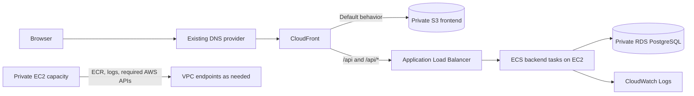

# FitTrack AWS architecture

This document is the single AWS record for FitTrack. It describes the planned architecture and decisions and records implementation state and verification as resources are created.

Planned resources, configured resources, and independently verified settings are clearly distinguished.

## Goals and constraints

- The initial scope is one production environment; staging is deferred.
- DNS remains with the current domain provider; Route 53 is excluded.
- Resources remain private unless public access is required for the ALB or CloudFront.
- Continuously billed resources should not remain idle during learning or long pauses. The app is unavailable when its runtime is stopped or deleted.
- CloudFormation templates are stored under `infra/cloudformation/`; stacks are deployed and inspected through CloudFormation. Actual outcomes and verification are recorded in this document.

## CloudFormation template checks

Install `cfn-lint` with Homebrew on macOS, then run the repository checks before creating or updating a stack:

```bash
brew install cfn-lint
npm run infra:check
```

`infra:check` runs Prettier against the CloudFormation templates and validates them with `cfn-lint` for `eu-central-1`. `cfn-lint` is a local tool and is not installed by `npm install`.

## Target request and data flow


```mermaid
flowchart LR
    Browser[Browser] --> DNS[Existing DNS provider]
    DNS --> CF[CloudFront]
    CF -->|Default behavior| S3[(Private S3 frontend)]
    CF -->|/api and /api/*| ALB[Application Load Balancer]
    ALB --> ECS[ECS backend tasks on EC2]
    ECS --> RDS[(Private RDS PostgreSQL)]
    ECS --> CW[CloudWatch Logs]
    EC2[Private EC2 capacity] -->|ECR, logs, required AWS APIs| VPCE[VPC endpoints as needed]
```

The static frontend is planned for a private S3 bucket served through CloudFront. CloudFront forwards `/api` and `/api/*` to an internet-facing Application Load Balancer. The ALB routes requests to healthy ECS backend tasks running on EC2 capacity in private application subnets. The backend connects to private RDS PostgreSQL and sends structured logs to CloudWatch. Private EC2 instances use only the VPC endpoints needed for AWS service access; no NAT Gateway is planned. DNS remains with the current provider and points the application hostname to CloudFront.

## Architecture decisions

| Area                 | Current direction                                                                                        | Status                                                                        |
| -------------------- | -------------------------------------------------------------------------------------------------------- | ----------------------------------------------------------------------------- |
| Region               | `eu-central-1` (Frankfurt)                                                                               | Proposed; confirm before creating regional resources                          |
| Network              | One VPC, two AZs, each with a public ALB subnet, private application subnet, and private database subnet | VPC foundation created in the AWS Console; configuration verification pending |
| Internet egress      | No NAT Gateway; add only necessary VPC endpoints when the EC2/ECS step requires them                     | Planned                                                                       |
| Network ACL          | Keep the default NACL initially; control workload access with security groups                            | Planned                                                                       |
| Frontend             | Private S3 origin with CloudFront Origin Access Control                                                  | Planned                                                                       |
| API entry            | Application Load Balancer (ELB) in public subnets                                                        | Planned                                                                       |
| Backend              | ECS service using EC2 capacity in private application subnets                                            | Planned                                                                       |
| Database             | RDS for PostgreSQL, initially Single-AZ, with a DB subnet group spanning both AZs                        | Planned                                                                       |
| Logs                 | Pino JSON on stdout/stderr, collected by ECS into CloudWatch Logs                                        | Planned                                                                       |
| DNS                  | Existing provider; no Route 53 hosted zone                                                               | Decided                                                                       |
| Environment sequence | Production first; staging deferred                                                                       | Decided                                                                       |

The CloudFront viewer certificate must use ACM in `us-east-1`; certificates for regional services use the service's region. Record certificate and DNS validation details here when configured.

## Cost and lifecycle direction

This architecture cannot remain continuously available at zero cost. An ALB, running EC2 capacity, running RDS, NAT Gateways, and some VPC endpoints can create ongoing charges. Runtime resources should be created when needed for testing or deployment. During a long pause, billable runtime resources can be stopped or deleted while retaining only data or artifacts worth their storage cost. Record retained, stopped, or removed resources and their verification results here.
