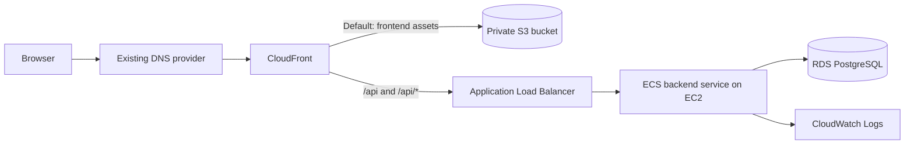

# FitTrack AWS deployment plan

This is the working record for building FitTrack's first AWS production environment manually in the AWS Console. Add actual resource identifiers, settings, and verification results here as each step is completed. A planned resource is not evidence that it exists or has been tested.

The infrastructure will be built incrementally and documented in this file as we go. It is not managed by CloudFormation or Terraform yet.

## Decisions and scope

| Topic                   | Current decision                                                                          | Status                                                         |
| ----------------------- | ----------------------------------------------------------------------------------------- | -------------------------------------------------------------- |
| AWS region              | `eu-central-1` (Europe Frankfurt)                                                         | Proposed; confirm in the AWS Console before creating resources |
| Environment             | One production environment to start                                                       | Planned                                                        |
| Infrastructure workflow | Create resources manually in AWS Console and record the resulting configuration here      | Planned                                                        |
| DNS                     | Keep DNS with the current domain provider; do not create Route 53 resources               | Decided                                                        |
| Frontend                | Private S3 bucket served through CloudFront                                               | Planned                                                        |
| API entry point         | Application Load Balancer (ALB), the Elastic Load Balancing service                       | Planned                                                        |
| Backend runtime         | ECS service using the EC2 launch type / EC2 capacity                                      | Planned                                                        |
| Database                | Amazon RDS for PostgreSQL, initially Single-AZ, in private subnets                        | Planned                                                        |
| Infrastructure as code  | Not used for the initial manual build; revisit after learning and validating the topology | Planned                                                        |
| Staging                 | Not part of the first environment                                                         | Deferred                                                       |

The region is a working proposal, not a final selection. Confirm it before creating resources because most resources must be colocated, while the CloudFront viewer certificate has a separate regional requirement.

## Naming convention

Use `fit-track-prod-<resource>-eu-central-1` for named resources where AWS permits it. Some AWS resource names have their own constraints; record the actual name or identifier below when created. Do not put secrets in resource names or this document.

| Resource                    | Proposed name                                           |
| --------------------------- | ------------------------------------------------------- |
| VPC                         | `fit-track-prod-vpc-eu-central-1`                       |
| Public subnets              | `fit-track-prod-public-<az>`                            |
| Private application subnets | `fit-track-prod-app-<az>`                               |
| Private database subnets    | `fit-track-prod-db-<az>`                                |
| ALB                         | `fit-track-prod-alb-eu-central-1`                       |
| ECS cluster                 | `fit-track-prod-cluster-eu-central-1`                   |
| ECS service                 | `fit-track-prod-backend-eu-central-1`                   |
| EC2 Auto Scaling group      | `fit-track-prod-ecs-asg-eu-central-1`                   |
| ECR backend repository      | `fit-track/backend`                                     |
| S3 frontend bucket          | `fit-track-prod-frontend-<account-id>-eu-central-1`     |
| CloudFront distribution     | AWS-generated ID; description `fit-track-prod-frontend` |
| RDS instance                | `fit-track-prod-postgres-eu-central-1`                  |
| CloudWatch log group        | `/fit-track/prod/backend`                               |

## Architecture outline

```mermaid
flowchart LR
    User[Browser] --> DNS[Existing DNS provider]
    DNS --> CF[CloudFront]
    CF -->|Default: frontend assets| S3[(Private S3 bucket)]
    CF -->|/api and /api/*| ALB[Application Load Balancer]
    ALB --> ECS[ECS backend service on EC2]
    ECS --> RDS[(RDS PostgreSQL)]
    ECS --> CW[CloudWatch Logs]
```

CloudFront will serve the frontend from S3 and forward `/api` and `/api/*` to the ALB. The ALB will route requests to healthy backend tasks managed by ECS on EC2 capacity. RDS will accept database connections only from the backend workload. The domain's DNS records stay with the existing DNS provider and point to CloudFront; Route 53 is not included.

## Resource implementation record

For each resource, update **Actual configuration**, **Connections**, and **Verification** after creating it. Until then, keep its status as `Not created` and its verification as `Not run`.

### 1. Region and account

- **Status:** Not confirmed
- **Proposed region:** `eu-central-1` (Europe Frankfurt)
- **Actual account/region:** Not recorded
- **Settings:** Confirm the AWS account and region selector before creating resources. CloudFront is global; its ACM viewer certificate must be requested in `us-east-1`. Other ACM certificates must be in the region of the service that uses them.
- **Connections:** Most resources below use the selected workload region. CloudFront connects the browser-facing hostname to S3 and the ALB origins.
- **Verification:** Not run. Confirm the account ID and selected region in the Console before proceeding; do not record credentials.

### 2. VPC, subnets, and routing

- **Status:** Not created
- **Proposed name:** `fit-track-prod-vpc-eu-central-1`
- **Actual VPC ID/CIDR:** Not recorded
- **Settings:** Plan public subnets for the internet-facing ALB and private subnets for ECS/EC2 and RDS across at least two Availability Zones. RDS is initially Single-AZ, but its DB subnet group still needs subnets in at least two AZs. Decide and record outbound access (NAT or required VPC endpoints) before launching private EC2 instances.
- **Connections:** ALB reaches ECS targets; ECS reaches RDS. ECS instances also need a path to retrieve ECR images and send logs to CloudWatch.
- **Verification:** Not run. After creation, verify subnet AZs, route tables, internet gateway/NAT or endpoints, and that database subnets have no public route.

### 3. Security groups

- **Status:** Not created
- **Proposed names:** `fit-track-prod-alb-sg`, `fit-track-prod-ecs-sg`, `fit-track-prod-rds-sg`
- **Actual IDs/rules:** Not recorded
- **Settings:** ALB accepts only the intended web traffic. ECS accepts the backend port only from the ALB security group. RDS accepts PostgreSQL only from the ECS security group. Keep RDS private; do not allow inbound database access from `0.0.0.0/0`.
- **Connections:** ALB security group → ECS security group → RDS security group.
- **Verification:** Not run. Inspect inbound and outbound rules and confirm the permitted source is the preceding tier's security group.

### 4. ECR

- **Status:** Not created
- **Proposed repository:** `fit-track/backend`
- **Actual URI/settings:** Not recorded
- **Settings:** Store the backend container image. Choose image scanning and retention settings when creating the repository; record the chosen policy and image tag/digest used for deployment.
- **Connections:** ECS EC2 instances authenticate to ECR and pull the backend image using the instance/task execution permissions and network egress.
- **Verification:** Not run. Later, push a known image, confirm its digest in ECR, and confirm an ECS instance can pull it.

### 5. IAM roles and instance profile

- **Status:** Not created
- **Proposed names:** `fit-track-prod-ecs-instance-role`, `fit-track-prod-ecs-task-execution-role`, `fit-track-prod-backend-task-role`
- **Actual ARNs/policies:** Not recorded
- **Settings:** Separate EC2 host permissions from ECS task execution permissions and application permissions. Grant only the actions needed for image pulls, log delivery, and application access to AWS resources. Never place access keys in the image, repository, or this document.
- **Connections:** The EC2 instance profile lets ECS container instances join the cluster; the task execution role supports image/log startup; the task role is available to backend application code.
- **Verification:** Not run. Review attached policies and confirm no broad administrator permissions are attached.

### 6. RDS PostgreSQL

- **Status:** Not created
- **Proposed identifier:** `fit-track-prod-postgres-eu-central-1`
- **Actual endpoint/engine/size:** Not recorded
- **Settings:** Private DB subnet group spanning at least two AZs; Single-AZ instance initially; encryption at rest; backups, retention, deletion protection, and credential/authentication approach to be recorded when selected. Do not record passwords or secret values.
- **Connections:** Backend tasks connect to the RDS endpoint on PostgreSQL's configured port. The RDS security group allows that port only from the ECS security group.
- **Verification:** Not run. Confirm the instance is not publicly accessible, backup and encryption settings are enabled as intended, and a test connection succeeds from the backend network.

### 7. ECS cluster, EC2 capacity, and backend service

- **Status:** Not created
- **Proposed names:** `fit-track-prod-cluster-eu-central-1`, `fit-track-prod-ecs-asg-eu-central-1`, `fit-track-prod-backend-eu-central-1`
- **Actual cluster/service/task definition:** Not recorded
- **Settings:** ECS cluster with EC2 capacity, an Auto Scaling group/capacity provider, backend task definition, explicit CPU/memory, port mapping, health check, desired count, and deployment settings. Place instances/tasks in private application subnets. Record the image digest, not just a moving tag.
- **Connections:** Tasks receive traffic from the ALB, connect to RDS, pull from ECR, and send container logs to CloudWatch.
- **Verification:** Not run. Confirm container instances register in the cluster, tasks become healthy, and the service replaces a stopped task.

### 8. Application Load Balancer (ELB)

- **Status:** Not created
- **Proposed name:** `fit-track-prod-alb-eu-central-1`
- **Actual DNS name/listeners/target group:** Not recorded
- **Settings:** Internet-facing ALB in public subnets across at least two AZs; target group for the backend port; health check path matching the implemented backend health endpoint; listener and TLS certificate settings to be decided. ALB forwards to ECS targets.
- **Connections:** CloudFront's `/api` and `/api/*` behaviors use the ALB as their origin; ALB forwards to healthy ECS tasks.
- **Verification:** Not run. Confirm target health, listener rules, certificate, and that the backend is reachable through the ALB.

### 9. S3 frontend bucket

- **Status:** Not created
- **Proposed name:** `fit-track-prod-frontend-<account-id>-eu-central-1`
- **Actual bucket name/region/policy:** Not recorded
- **Settings:** Private bucket, public access blocked, static frontend build files uploaded by the release process. CloudFront Origin Access Control (OAC) grants the distribution access; the bucket is not configured for public website hosting.
- **Connections:** CloudFront fetches the frontend assets from S3 through OAC.
- **Verification:** Not run. Confirm direct public bucket access is denied and the frontend loads through CloudFront.

### 10. CloudFront and TLS

- **Status:** Not created
- **Proposed description:** `fit-track-prod-frontend`
- **Actual distribution ID/domain/behaviors:** Not recorded
- **Settings:** Default behavior serves the S3 frontend origin; `/api` and `/api/*` route to the ALB origin. Configure cache behavior, forwarded headers/cookies/query strings, HTTPS redirect, and the required application security headers. The CloudFront viewer certificate must be in `us-east-1`; record certificate ARN and DNS validation status, not private key material.
- **Connections:** Browser → CloudFront → S3 for frontend and ALB for API. The existing DNS provider maps the chosen application hostname to the distribution.
- **Verification:** Not run. Confirm HTTPS, SPA route fallback, both API path patterns, expected cache behavior, and response headers using the public hostname.

### 11. CloudWatch Logs

- **Status:** Not created
- **Proposed log group:** `/fit-track/prod/backend`
- **Actual ARN/retention:** Not recorded
- **Settings:** ECS awslogs driver, region matching the workload, explicit retention, and no sensitive values in application logs.
- **Connections:** ECS backend container stdout/stderr streams to this log group. Pino already writes structured logs to stdout/stderr.
- **Verification:** Not run. Confirm a test request produces a structured log with its request ID and that secrets and request bodies are absent.

### 12. DNS at the existing provider

- **Status:** Not configured for AWS
- **Provider/hostname/record:** Not recorded
- **Settings:** Keep the domain's DNS hosted by the existing provider. Once CloudFront is ready, configure the provider's supported alias/CNAME record for the application hostname to the CloudFront distribution. Route 53 hosted zones and records are intentionally excluded.
- **Connections:** The hostname resolves to CloudFront; CloudFront forwards to S3 or the ALB based on the request path.
- **Verification:** Not run. Confirm DNS resolution and HTTPS after the record is published.

## Implementation order

1. Confirm AWS account, region, domain/DNS provider, and resource names.
2. Create VPC, subnets, routing, and security groups; verify the network boundaries.
3. Create ECR and IAM roles needed for ECS image pulls and logs.
4. Create the RDS subnet group and private Single-AZ PostgreSQL instance; verify its settings.
5. Create the ECS cluster and EC2 capacity, then deploy the backend service and verify health and database connectivity.
6. Create the ALB and verify healthy ECS targets and API access.
7. Create the private S3 bucket and CloudFront distribution; configure frontend and API behaviors and TLS.
8. Configure DNS at the existing provider and run public end-to-end checks.
9. Add deployment automation and alarms after the manual path is understood and verified.

## Update log

| Date       | Resource/decision updated                        | Evidence and result                                            |
| ---------- | ------------------------------------------------ | -------------------------------------------------------------- |
| 2026-09-28 | Initial plan recorded; no AWS resources verified | Plan only; resource creation and verification have not started |
