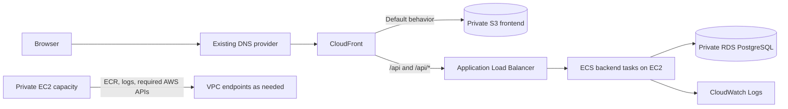

# FitTrack AWS architecture

This document is the single AWS record for FitTrack. It describes the planned architecture and decisions and records implementation state and verification as resources are created.

Planned resources, configured resources, and independently verified settings are clearly distinguished.

## Goals and constraints

- The initial scope is one production environment; staging is deferred.
- DNS remains with the current domain provider; Route 53 is excluded.
- Resources remain private unless public access is required for the ALB or CloudFront.
- Continuously billed resources should not remain idle during learning or long pauses. The app is unavailable when its runtime is stopped or deleted.
- CloudFormation templates are stored under `infra/`; stacks are deployed and inspected through CloudFormation. Actual outcomes and verification are recorded in this document.

## CloudFormation template checks

Install `cfn-lint` with Homebrew on macOS, then run the repository checks before creating or updating a stack:

```bash
brew install cfn-lint
npm run infra:check
```

`infra:check` runs Prettier against the CloudFormation templates and validates them with `cfn-lint` for `eu-central-1`. `cfn-lint` is a local tool and is not installed by `npm install`.

## Target request and data flow


```mermaid
flowchart LR
    Browser[Browser] --> DNS[Existing DNS provider]
    DNS --> CF[CloudFront]
    CF -->|Default behavior| S3[(Private S3 frontend)]
    CF -->|/api and /api/*| ALB[Application Load Balancer]
    ALB --> ECS[ECS backend tasks on EC2]
    ECS --> RDS[(Private RDS PostgreSQL)]
    ECS --> CW[CloudWatch Logs]
    EC2[Private EC2 capacity] -->|ECR, logs, required AWS APIs| VPCE[VPC endpoints as needed]
```

The static frontend is planned for a private S3 bucket served through CloudFront. CloudFront forwards `/api` and `/api/*` to an internet-facing Application Load Balancer. The ALB routes requests to healthy ECS backend tasks running on EC2 capacity in private application subnets. The backend connects to private RDS PostgreSQL and sends structured logs to CloudWatch. Private EC2 instances use only the VPC endpoints needed for AWS service access; no NAT Gateway is planned. DNS remains with the current provider and points the application hostname to CloudFront.

## Architecture decisions

| Area                 | Current direction                                                                                                                                                          | Status                                                                    |
| -------------------- | -------------------------------------------------------------------------------------------------------------------------------------------------------------------------- | ------------------------------------------------------------------------- |
| Region               | `eu-central-1` (Frankfurt)                                                                                                                                                 | Decided                                                                   |
| Network              | One VPC (`10.20.0.0/20`) across two AZs, with public ALB, private application, and private database subnets in each AZ; one IGW; separate public, app, and DB route tables | CloudFormation template drafted; not deployed; AWS resources not verified |
| Internet egress      | No NAT Gateway; add only necessary VPC endpoints when the EC2/ECS step requires them                                                                                       | Planned                                                                   |
| Network ACL          | Keep the default NACL initially; control workload access with security groups                                                                                              | Planned                                                                   |
| Frontend             | Private S3 origin with CloudFront Origin Access Control                                                                                                                    | Planned                                                                   |
| API entry            | Application Load Balancer (ELB) in public subnets                                                                                                                          | Planned                                                                   |
| Backend              | ECS service using EC2 capacity in private application subnets                                                                                                              | Planned                                                                   |
| Database             | RDS for PostgreSQL, initially Single-AZ, with a DB subnet group spanning both AZs                                                                                          | Planned                                                                   |
| Logs                 | Pino JSON on stdout/stderr, collected by ECS into CloudWatch Logs                                                                                                          | Planned                                                                   |
| DNS                  | Existing provider; no Route 53 hosted zone                                                                                                                                 | Decided                                                                   |
| Environment sequence | Production first; staging deferred                                                                                                                                         | Decided                                                                   |

The CloudFront viewer certificate must use ACM in `us-east-1`; certificates for regional services use the service's region. Record certificate and DNS validation details here when configured.

## Network foundation template

`infra/network/template.yaml` defines the production VPC foundation. Its `Name` tags follow `fit-track-prod-<resource>-eu-central-1`; resources also carry `Environment`, `Project`, and `Component` tags.

| Resources           | Name tags                                                                                                          | Settings and connections                                                                                                                                   |
| ------------------- | ------------------------------------------------------------------------------------------------------------------ | ---------------------------------------------------------------------------------------------------------------------------------------------------------- |
| VPC                 | `fit-track-prod-vpc-eu-central-1`                                                                                  | CIDR `10.20.0.0/20`; DNS support and hostnames enabled.                                                                                                    |
| Public subnets      | `fit-track-prod-public-az1-eu-central-1`, `fit-track-prod-public-az2-eu-central-1`                                 | `10.20.0.0/24` in `euc1-az1`, `10.20.1.0/24` in `euc1-az2`; associated with the public route table.                                                        |
| Application subnets | `fit-track-prod-app-az1-eu-central-1`, `fit-track-prod-app-az2-eu-central-1`                                       | `10.20.2.0/24` in `euc1-az1`, `10.20.3.0/24` in `euc1-az2`; associated with the private application route table.                                           |
| Database subnets    | `fit-track-prod-db-az1-eu-central-1`, `fit-track-prod-db-az2-eu-central-1`                                         | `10.20.4.0/24` in `euc1-az1`, `10.20.5.0/24` in `euc1-az2`; associated with the private database route table.                                              |
| Internet gateway    | `fit-track-prod-igw-eu-central-1`                                                                                  | Attached to the VPC.                                                                                                                                       |
| Route tables        | `fit-track-prod-rt-public-eu-central-1`, `fit-track-prod-rt-app-eu-central-1`, `fit-track-prod-rt-db-eu-central-1` | Public route table sends `0.0.0.0/0` to the IGW. App and DB route tables have no internet default route; no NAT Gateway or VPC endpoints are included yet. |

All six subnets explicitly disable automatic public IPv4 assignment. The public subnet route prepares the network path for the later internet-facing ALB; its scheme and security groups will be defined with the ALB. Application and database route tables have no internet default route. The template exports its VPC ID and CIDR, AZ IDs (`euc1-az1` and `euc1-az2`), subnet IDs, and route table IDs for same-account, same-region stacks. The AZ ID outputs are `AvailabilityZoneAz1Id` and `AvailabilityZoneAz2Id`; they match the AZ IDs assigned to the corresponding subnets. Export names use `<network-stack-name>-<output-name>`; for example, stack `fit-track-prod-network` exports `fit-track-prod-network-AppSubnetAz1Id` and `fit-track-prod-network-AvailabilityZoneAz1Id`. A consuming template can import these values with `Fn::ImportValue`. CloudFormation prevents changing or deleting an export while another stack imports it. `npm run infra:check` validates formatting and the CloudFormation template locally. The template has not been deployed, so no AWS resource configuration has been independently verified.

## VPC endpoints template

`infra/endpoints/template.yaml` drafts eight interface endpoints (`ecr.api`, `ecr.dkr`, `ecs`, `ecs-agent`, `ecs-telemetry`, `ssm`, `ssmmessages`, and `ec2messages`) in both application subnets, plus an S3 gateway endpoint on the application route table. The SSM endpoints provide private Systems Manager and Session Manager connectivity to the EC2 instances; the instance role includes `AmazonSSMManagedInstanceCore`. The S3 endpoint policy permits `s3:GetObject` only from the regional ECR image-layer bucket. ECR, ECS, and SSM endpoint policies remain at AWS defaults to avoid restricting service agent calls prematurely. The interface endpoint security group permits TCP 443 from the two application subnet CIDRs (`10.20.2.0/24` and `10.20.3.0/24`); SSM Agent initiates outbound connections, so no inbound rule is needed on the EC2 instance security group. Each interface endpoint is provisioned in both AZs; this adds six billable endpoint-AZ attachments for SSM. The endpoint resources and security group use the project, environment, component, and Name tags. The template is not deployed or AWS-verified; `npm run infra:check` validates its local format and CloudFormation schema.

## Compute template

`infra/compute/template.yaml` drafts the ECS-on-EC2 production compute stack. It imports the VPC ID and both application subnet IDs from the network stack. The Auto Scaling group places instances in those private app subnets across `euc1-az1` and `euc1-az2`; the subnet IDs determine the group's Availability Zones. Its minimum and default desired capacity are two instances for multi-AZ availability, and the default maximum is three. `MinSize`, `DesiredCapacity`, and `MaxSize` are stack parameters; `MinSize` and `DesiredCapacity` cannot be set below two. Deployment inputs must keep `MaxSize` at least as large as both values. ECS managed scaling uses a one-instance scaling step and 100% target capacity. The cluster name is `fit-track-${Environment}-ecs-cluster-eu-central-1`; the capacity provider name is `fit-track-${Environment}-ecs-cp-eu-central-1` and is associated with the cluster as its default strategy. The EC2 instance role and profile have explicit names; the role uses `AmazonEC2ContainerServiceforEC2Role` and `AmazonSSMManagedInstanceCore`. Resources use the `Name`, `Environment`, `Project`, and `Component` tags where CloudFormation supports tags, and the Auto Scaling group propagates instance tags at launch. The launch template also tags its EBS root volume. Instances use the recommended Amazon Linux 2023 ECS-optimized AMI, require IMDSv2, and have an encrypted 30 GiB gp3 root volume. Bootstrap writes the cluster name to `/etc/ecs/ecs.config` and fails immediately on a shell error. `t3.small` is the default and `t3.medium` is available; the final size remains subject to task CPU and memory requirements, which are not yet defined. The Auto Scaling group balances capacity across the two AZs and uses rolling instance refresh with one-at-a-time replacement capacity and ECS scale-in protection handling. It does not enable zonal shift. Outputs export the cluster name and ARN, capacity provider name, and instance security group ID for downstream stacks. The instance security group has no inbound application rule; a later ECS service stack will own task networking and the ALB-to-backend rule. The stack is not deployed or AWS-verified. Local formatting and `cfn-lint` validation are recorded by `npm run infra:check`.

## Cost and lifecycle direction

This architecture cannot remain continuously available at zero cost. An ALB, running EC2 capacity, running RDS, NAT Gateways, and some VPC endpoints can create ongoing charges. Runtime resources should be created when needed for testing or deployment. During a long pause, billable runtime resources can be stopped or deleted while retaining only data or artifacts worth their storage cost. Record retained, stopped, or removed resources and their verification results here.
