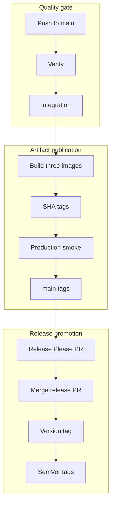
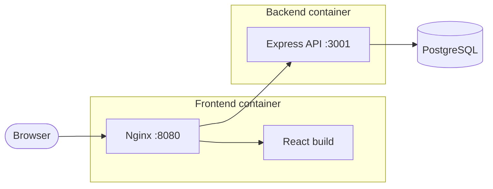

# Release and container process

FitTrack uses GitHub Actions to verify the repository, publish immutable container artifacts, and manage one product version across all workspaces.

## Pipeline overview



The image workflow runs only after the `Test` workflow succeeds for a push to `main`. It checks out the exact tested SHA rather than the current branch tip, pushes immutable SHA tags, then smoke-tests those images before promoting the moving `main` tags. A pull request or push that changes only Markdown files skips the `Test` workflow and therefore does not publish images. Release Please creates or updates a release pull request after artifact publication; merging that pull request creates the version tag and GitHub Release, which promote the matching immutable image digests to SemVer tags.

## Published images

| Image                 | Docker target | Purpose                                                  |
| --------------------- | ------------- | -------------------------------------------------------- |
| `fit-track-backend`   | `production`  | Compiled Express application and production dependencies |
| `fit-track-frontend`  | `production`  | Static React assets served by unprivileged Nginx         |
| `fit-track-migration` | `migration`   | Prisma CLI, generated client, and committed migrations   |

Images are built for `linux/amd64` and `linux/arm64`. Each build publishes an SBOM and max-level provenance attestation.

## Image tags

After a successful build and production smoke test, every image receives:

- immutable `sha-<commit>`;
- moving `main`.

A release promotes the already-built SHA digest without rebuilding it and adds:

- exact version, for example `1.2.3`;
- minor line, for example `1.2`;
- major line, for example `1`;
- moving `latest`.

Use an immutable SHA or exact version for deployments and migration jobs. Never apply migrations from `main` or `latest` because those tags can move.

## Migration ordering

Committed Prisma migrations are append-only deployment artifacts. A release should follow this order:

1. select matching backend and migration images from the same immutable SHA;
2. run the migration image once with the target `DATABASE_URL`;
3. stop if `prisma migrate deploy` fails;
4. start or update the matching backend image;
5. wait for `/api/health/ready` before sending traffic;
6. update the frontend when required.

Do not run migrations independently from every backend process at startup.

The development Compose stack follows the same principle: PostgreSQL becomes healthy, the one-off migration service succeeds, and only then does the backend start. The test stack applies the complete migration chain to a temporary database.

## Release Please

Release Please treats the monorepo as one versioned product. Conventional Commit types drive the proposed version:

- `fix:` requests a patch release;
- `feat:` requests a minor release;
- `!` or a `BREAKING CHANGE` footer requests a major release;
- `docs:`, `test:`, `ci:`, and `chore:` normally do not request a product release.

Configure `RELEASE_PLEASE_TOKEN` as a fine-grained repository token with read/write access to contents, pull requests, and issues. The token allows Release Please-created changes and tags to trigger the normal workflows.

After image publication on `main`, Release Please creates or updates a release pull request. Review the generated version and changelog, wait for checks, and squash-merge it. The merge is verified and published by SHA before Release Please creates the version tag and GitHub Release.

Do not manually create or move release tags during the normal process. Publish a new patch version when a released artifact needs correction.

To intentionally override the proposed next version, use a `Release-As` footer:

```bash
git commit --allow-empty \
  -m "chore: prepare release 1.0.0" \
  -m "Release-As: 1.0.0"
```

## Local workflow validation

Install the optional local tools:

```bash
brew install act actionlint
```

Then run:

```bash
npm run actions:lint
npm run actions:list
npm run actions:check
npm run actions:verify
```

`actionlint` is the authoritative static YAML check. `act` approximates a GitHub-hosted runner but does not reproduce service containers and all runner behavior exactly. Use `npm run test:docker` for the local PostgreSQL integration lifecycle and confirm runner-specific changes with a real GitHub Actions run.

If a future local workflow simulation requires a secret, pass it interactively with `act -s SECRET_NAME`. Do not commit `.secrets`, `.vars`, `.input`, environment files, or credentials.

## Production runtime

The frontend production image runs unprivileged Nginx on port `8080`; the backend production image runs as the unprivileged `node` user on port `3001` and checks `/api/health/live`.



Nginx gives the browser one public origin. It serves the React build and forwards only `/api` requests to the API; PostgreSQL is never exposed to the browser.

| Request path          | Nginx behavior                                                                                                  |
| --------------------- | --------------------------------------------------------------------------------------------------------------- |
| `/assets/`            | Serves hashed Vite assets with immutable one-year caching.                                                      |
| `/` and client routes | Serves the React single-page application with an `index.html` fallback.                                         |
| `/api/`               | Proxies to the `fittrack_backend` upstream at `backend:3001`, forwarding host, client IP, and protocol headers. |
| `/health`             | Returns a no-cache Nginx health response without writing an access log.                                         |

Nginx enforces a 100 KB request body limit, disables version tokens, enables gzip for suitable text assets, and applies connect, send, and read proxy timeouts. A production runtime must preserve the internal `backend:3001` hostname or provide an equivalent route.

After the images are pushed with immutable SHA tags, the image workflow starts the production smoke stack. It starts an ephemeral PostgreSQL database, applies committed migrations with the final migration image, and starts the final backend and Nginx images. The check proves:

- frontend `/health`;
- backend `/api/health/live`;
- backend `/api/health/ready`;
- the Nginx-served SPA entry point;
- a browser-equivalent request through Nginx `/api` to backend readiness.

The stack uses host ports `13001` and `18080` by default so it does not collide with local development. To run the stack locally, first build the three local image tags and then start it:

```bash
docker build --target production --tag fit-track-backend:smoke -f backend/Dockerfile .
docker build --target migration --tag fit-track-migration:smoke -f backend/Dockerfile .
docker build --target production --tag fit-track-frontend:smoke -f frontend/Dockerfile .
docker compose -f compose.production-smoke.yaml up --detach --wait --wait-timeout 120
```

Clean up afterward with `docker compose -f compose.production-smoke.yaml down --volumes --remove-orphans`. Set `SMOKE_BACKEND_PORT` or `SMOKE_FRONTEND_PORT` when the default host ports are unavailable.
