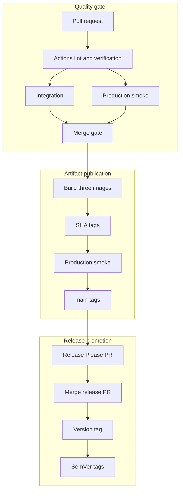

# Release and container process

FitTrack uses GitHub Actions to verify the repository, publish immutable container artifacts, and manage one product version across all workspaces.

## Pipeline overview



Every pull request builds and smoke-tests the final production targets before merge, including documentation-only pull requests. The image workflow then runs only after the complete `Test` workflow succeeds for a non-documentation push to `main`. It checks out the exact tested SHA rather than the current branch tip, pushes immutable SHA tags, smoke-tests those registry artifacts, and only then promotes the moving `main` tags. A push to `main` that changes only Markdown files skips post-merge testing and image publication because its pull request was already fully checked. Release Please creates or updates a release pull request after artifact publication; merging that pull request creates the version tag and GitHub Release, which promote the matching immutable image digests to SemVer tags.

## Protected main workflow

`main` is the stable integration branch. After branch protection is enabled, all feature, fix, documentation, and release changes reach it through pull requests rather than direct pushes.

For each logical change:

```bash
git switch main
git pull --ff-only
git switch -c feat/workout-pagination

# Edit the relevant files, then run the narrowest checks while iterating.
npm run verify

git add -- <changed-files>
git commit -m "feat: add workout pagination"
git push -u origin feat/workout-pagination
```

Open a pull request from the pushed branch into `main`. The first push creates the remote tracking branch; later corrections use the same local branch and normally require only `git push`. Each push updates the existing pull request and reruns its checks, so a new branch or pull request is not needed for every commit.

The repository ruleset for `main` should:

- require a pull request before merging;
- require the branch to be up to date with `main` before merging;
- require all review conversations to be resolved;
- require the exact `Actions lint`, `Verify`, `Integration`, and `Production container smoke` status checks;
- block force pushes and deletion of `main`;
- provide no routine bypass for repository administrators or automation.

A solo-maintainer repository may use zero required approving reviews while still requiring the pull request itself and all automated checks. Increase the approval count when another regular reviewer is available.

If any required check fails, `main` remains unchanged. Fix the problem on the pull-request branch, commit it, push again, and wait for the new check run. Do not merge by bypassing, dismissing, or weakening the required check. After merge, synchronize and clean up locally:

```bash
git switch main
git pull --ff-only
git branch -d feat/workout-pagination
```

Release Please pull requests use the same protected path. Never merge a stale release pull request: first allow it to incorporate the latest commits from `main`, review its proposed version and changelog, and wait for all four required checks to pass.

## Published images

| Image                 | Docker target | Purpose                                                  |
| --------------------- | ------------- | -------------------------------------------------------- |
| `fit-track-backend`   | `production`  | Compiled Express application and production dependencies |
| `fit-track-frontend`  | `production`  | Static React assets served by unprivileged Nginx         |
| `fit-track-migration` | `migration`   | Prisma CLI, generated client, and committed migrations   |

Images are built for `linux/amd64` and `linux/arm64`. Each build publishes an SBOM and max-level provenance attestation.

The current request topology and container behavior are documented in [architecture](architecture.md); exact production-smoke coverage and local commands belong in the [testing strategy](testing.md#production-container-smoke-tests). The future AWS topology is separate from these currently verified artifacts and is described in the [AWS deployment plan](aws-deployment-plan.md).

## Image tags

After a successful build and production smoke test, every image receives:

- immutable `sha-<commit>`;
- moving `main`.

A release promotes the already-built SHA digest without rebuilding it and adds:

- exact version, for example `1.2.3`;
- minor line, for example `1.2`;
- major line, for example `1`;
- moving `latest`.

Use an immutable SHA or exact version for deployments and migration jobs. Never apply migrations from `main` or `latest` because those tags can move.

## Migration ordering

Committed Prisma migrations are append-only deployment artifacts. A release should follow this order:

1. select matching backend and migration images from the same immutable SHA;
2. run the migration image once with the target `DATABASE_URL`;
3. stop if `prisma migrate deploy` fails;
4. start or update the matching backend image;
5. wait for `/api/health/ready` before sending traffic;
6. update the frontend when required.

Do not run migrations independently from every backend process at startup.

The development Compose stack follows the same principle: PostgreSQL becomes healthy, the one-off migration service succeeds, and only then does the backend start. The test stack applies the complete migration chain to a temporary database.

## Release Please

Release Please treats the monorepo as one versioned product. Conventional Commit types drive the proposed version:

- `fix:` requests a patch release;
- `feat:` requests a minor release;
- `!` or a `BREAKING CHANGE` footer requests a major release;
- `docs:`, `test:`, `ci:`, and `chore:` normally do not request a product release.

The release pull request updates the root, frontend, backend, and shared `package.json` versions together with their `package-lock.json` entries. The manifest, Git tag, changelog, and every workspace therefore describe the same product version; workspace packages are not released independently. Review these exact entries in a release pull request and never update dependency versions through a repository-wide replacement.

Configure `RELEASE_PLEASE_TOKEN` as a fine-grained repository token with read/write access to contents, pull requests, and issues. The token allows Release Please-created changes and tags to trigger the normal workflows.

After image publication on `main`, Release Please creates or updates a release pull request. Review the generated version and changelog, wait for checks, and squash-merge it. The merge is verified and published by SHA before Release Please creates the version tag and GitHub Release.

Do not manually create or move release tags during the normal process. Publish a new patch version when a released artifact needs correction.

### One-time 1.0.0 production baseline

Version `1.0.0` is the first production release and maintained version baseline. Its preparation PR intentionally aligns the root package, all three workspaces, root and workspace lockfile entries, Release Please manifest, and changelog at `1.0.0`.

Before the manual release step below, those files describe a prepared baseline rather than an already published tag or GitHub Release.

Because this baseline is established before Release Please owns the `1.x` line, publish it with this one-time bootstrap sequence:

1. merge the baseline PR only after `Actions lint`, `Verify`, `Integration`, and `Production container smoke` pass;
2. wait for the merge commit's `Test` workflow and subsequent `Build and Push to GHCR` workflow to succeed;
3. confirm that backend, frontend, and migration images exist with `sha-<merge-commit>` tags;
4. create GitHub Release `v1.0.0` targeting that exact commit on `main` and use the `1.0.0` changelog section as its notes;
5. wait for `Release Images` to validate the tag and promote the same immutable image digests to `1.0.0`, `1.0`, `1`, and `latest`.

Never create the tag before immutable images for its commit have passed their registry smoke test. Once `v1.0.0` exists, this exception is complete: Release Please discovers the manifest and tag as the current release and owns every later version through its normal protected PR flow. A `fix:` then proposes `1.0.1`, a `feat:` proposes `1.1.0`, and a breaking change proposes `2.0.0`.

To intentionally override the proposed next version, use a `Release-As` footer:

```bash
git commit --allow-empty \
  -m "chore: prepare release 2.0.0" \
  -m "Release-As: 2.0.0"
```

## Workflow validation

Run `npm run actions:lint` after changing a workflow or local action. Local simulation cannot reproduce every GitHub-hosted runner behavior, so the pull request checks remain authoritative. Never commit local workflow secrets or credentials.

## Dependency update automation

Dependabot checks GitHub Actions and the root npm workspace weekly. Minor and patch npm updates are grouped by production or development responsibility, while major updates remain individually reviewable.

Docker coverage is also weekly. The `docker` ecosystem scans the root, backend, and frontend Dockerfile directories; the separate `docker-compose` ecosystem scans the root Compose definitions. Dependabot pull requests are not auto-merged: they follow the same protected `main` pull-request path and required checks as contributor changes.
