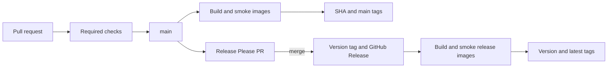

# Release and container process

FitTrack uses protected pull requests for source changes, publishes verified container images from `main`, and uses Release Please for versions, changelog entries, tags, and GitHub Releases.

## Pipeline overview



Every pull request runs the complete quality gate. A push to `main` has two independent effects:

- Release Please creates or updates one release pull request from Conventional Commits;
- after the `Test` workflow succeeds for a source or configuration change, the image workflow builds all three production images, smoke-tests their exact digests, and publishes the `main` tags. Markdown-only pushes do not rebuild images.

Merging the Release Please pull request is the explicit release action. Release Please then creates the version tag and GitHub Release. The tag starts the release-image workflow, which rebuilds that revision, smoke-tests the returned digests, and publishes the version and `latest` image tags.

## Protected main workflow

Normal changes use a short-lived branch and pull request:

```bash
git switch main
git pull --ff-only
git switch -c feat/workout-pagination

# Make and verify the change.
npm run verify

git add -- <changed-files>
git commit -m "feat: add workout pagination"
git push -u origin feat/workout-pagination
gh pr create --base main
```

Later corrections stay on the same branch and pull request. Push the additional commits and wait for the new checks.

The `main` ruleset requires:

- a pull request that is current with `main`;
- resolved review conversations;
- `Actions lint`, `Dependency review`, `Verify`, `Integration`, `Browser E2E`, and `Production container smoke`;
- the separate CodeQL code-scanning rule;
- rebase merges only;
- no force pushes or deletion of `main`.

Release Please pull requests use the same merge gate. Review the proposed version and changelog, and merge only when publishing a release is intentional. Opening, updating, or closing the pull request publishes nothing.

## Published images

| Image                 | Docker target | Purpose                                                  |
| --------------------- | ------------- | -------------------------------------------------------- |
| `fit-track-backend`   | `production`  | Compiled Express application and production dependencies |
| `fit-track-frontend`  | `production`  | Static React assets served by unprivileged Nginx         |
| `fit-track-migration` | `migration`   | Minimal Prisma CLI runtime and committed migrations      |

Images are built for `linux/amd64` and `linux/arm64` with an SBOM and provenance attestation.

Successful `main` builds publish:

- `sha-<commit>`;
- `main`.

Successful release builds additionally publish:

- the exact version without the `v` prefix, for example `0.2.0`;
- `latest`.

Workflows smoke-test exact digests returned by the builds before applying moving tags. Deployments and migrations should use digests; `main` and `latest` are convenience tags that move.

This process publishes artifacts only. The current deployment boundary and planned AWS topology are documented in the [AWS deployment plan](aws-deployment-plan.md); container validation is documented in the [testing guide](testing.md).

## Migration ordering

Deploy each schema and application change in this order:

1. build the migration, backend, and frontend images from the same revision;
2. smoke-test the exact image digests;
3. run the migration image once with the target database connection;
4. require a successful migration exit;
5. deploy the matching backend and frontend digests;
6. confirm backend readiness before routing traffic.

Backend replicas never run migrations during startup. Changes that cannot tolerate old and new application revisions at the same time require an expand-and-contract migration across separate releases.

## Release Please

Release Please treats the monorepo as one versioned product. Conventional Commit types drive the proposed version:

- `fix:` and `perf:` propose a patch;
- `feat:` proposes a minor;
- `!` or a `BREAKING CHANGE` footer proposes a major;
- `build:`, `chore:`, `ci:`, `docs:`, and `test:` do not by themselves propose a release.

The release pull request coordinates the root, backend, frontend, and shared package versions. Release Please owns the product versions, root lockfile entries, manifest, changelog, version tag, and GitHub Release. Do not edit those release artifacts manually during ordinary development.

Configure `RELEASE_PLEASE_TOKEN` as a fine-grained repository token with read/write access to contents, pull requests, and issues. This token allows Release Please-created pull requests and tags to trigger the repository workflows.

Before building release images, `scripts/release/validate.sh` requires a semantic version tag and matching package, lockfile, and Release Please manifest versions. After the exact build digests pass the production smoke test, `scripts/release/promote-images.sh` accepts only digest references and refuses to move an existing version tag to different content. `npm run test:release-tools` covers these critical rules.

## Workflow validation

Changes to GitHub Actions or local actions require:

```bash
npm run actions:lint
```

They must also pass the repository's required pull-request checks. See the [testing guide](testing.md) for the complete validation matrix.
