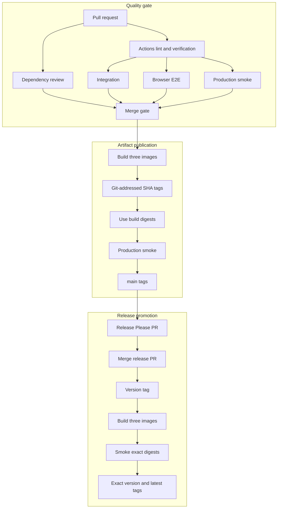

# Release and container process

FitTrack uses GitHub Actions to verify the repository, publish digest-addressed container artifacts, and manage one product version across all workspaces. This is an implemented artifact-release process, not a cloud deployment pipeline: it ends with verified images in GHCR.

The process follows three principles:

- **gate source before merge:** static checks, fast tests, PostgreSQL integration, and final-container smoke tests must pass;
- **test exact release content:** every moving or version tag is created from the digest that passed smoke testing in the same workflow run;
- **migrate before application rollout:** a dedicated migration artifact must succeed before the matching backend revision starts.

## Pipeline overview



Every pull request builds and smoke-tests the final production targets before merge, including documentation-only pull requests. The image workflow then runs only after the complete `Test` workflow succeeds for a non-documentation push to `main`. It checks out the exact tested SHA rather than the current branch tip, publishes Git-addressed SHA tags, smoke-tests the exact digests returned by that build, and only then promotes those digests to the moving `main` tags. A push to `main` that changes only Markdown files skips post-merge testing and image publication because its pull request was already fully checked. Release Please creates or updates a release pull request after artifact publication. Its version tag starts one self-contained workflow that rebuilds that tagged revision, smoke-tests the returned digests, and promotes those same references to the exact version and `latest` tags.

## Protected main workflow

`main` is the stable integration branch. After branch protection is enabled, all feature, fix, documentation, and release changes reach it through pull requests rather than direct pushes.

For each logical change:

```bash
git switch main
git pull --ff-only
git switch -c feat/workout-pagination

# Edit the relevant files, then run the narrowest checks while iterating.
npm run verify

git add -- <changed-files>
git commit -m "feat: add workout pagination"
git push -u origin feat/workout-pagination
```

Create the pull request with GitHub CLI after the first push:

```bash
gh pr create \
  --base main \
  --head feat/workout-pagination \
  --title "feat: add workout pagination" \
  --body "## Summary

- add paginated workout loading
- preserve the existing workout filters

## Validation

- npm run verify"
```

Use a concise outcome-oriented title. In the description, summarize the behavior and list the checks that actually ran. Alternatively, open the compare link printed by `git push`, confirm that the base branch is `main`, enter the same title and description, and select **Create pull request**.

The first push creates the remote tracking branch. Later corrections stay on the same local branch and normally require only:

```bash
git push
gh pr checks --watch
```

Each push updates the existing pull request and reruns its checks, so a new branch or pull request is not needed for every commit. Use `gh pr view --web` to reopen the current branch's pull request in a browser.

The repository ruleset for `main` should:

- require a pull request before merging;
- require the branch to be up to date with `main` before merging;
- require all review conversations to be resolved;
- require the exact `Actions lint`, `Dependency review`, `Verify`, `Integration`, `Browser E2E`, and `Production container smoke` status checks;
- permit rebase merges only, preserving reviewed commits while keeping `main` linear;
- block force pushes and deletion of `main`;
- provide no routine bypass for repository administrators or automation.

A solo-maintainer repository may use zero required approving reviews while still requiring the pull request itself and all automated checks. Increase the approval count when another regular reviewer is available.

If any required check fails, `main` remains unchanged. Fix the problem on the pull-request branch, commit it, push again, and wait for the new check run. Do not merge by bypassing, dismissing, or weakening the required check. After merge, synchronize and clean up locally:

```bash
git switch main
git pull --ff-only
git branch -d feat/workout-pagination
```

Release Please pull requests use the same protected path. Never merge a stale release pull request: first allow it to incorporate the latest commits from `main`, review its proposed version and changelog, and wait for all six required checks to pass.

## Published images

| Image                 | Docker target | Purpose                                                  |
| --------------------- | ------------- | -------------------------------------------------------- |
| `fit-track-backend`   | `production`  | Compiled Express application and production dependencies |
| `fit-track-frontend`  | `production`  | Static React assets served by unprivileged Nginx         |
| `fit-track-migration` | `migration`   | Prisma CLI, generated client, and committed migrations   |

Images are built for `linux/amd64` and `linux/arm64`. Each build publishes an SBOM and max-level provenance attestation.

The current request topology and container behavior are documented in [architecture](architecture.md); exact production-smoke coverage and local commands belong in the [testing strategy](testing.md#production-container-smoke-tests). The future AWS topology is separate from these currently verified artifacts and is described in the [AWS deployment plan](aws-deployment-plan.md).

## Image tags

After a successful build and production smoke test, every image receives:

- Git-addressed `sha-<commit>`;
- moving `main`.

A release rebuilds the tagged revision, smoke-tests the exact build digests, and adds these tags to the same content:

- exact version, for example `1.2.3`;
- moving `latest`.

Only an `image@sha256:<digest>` reference is technically immutable. The `sha-<commit>` image tag records the Git revision and can be replaced by a rerun. Neither publication workflow trusts that movable tag as its promotion input: each uses the digest returned by its own build for both smoke testing and subsequent tagging.

Prefer a content digest for deployments and migration jobs; a Git-addressed SHA or exact version is the human-readable release reference. Never apply migrations from `main` or `latest` because those tags can move.

## Migration ordering

Committed Prisma migrations are append-only deployment artifacts. A release should follow this order:

1. select backend and migration references from the same exact release version or release workflow digests;
2. run the migration image once with the target `DATABASE_URL`;
3. stop if `prisma migrate deploy` fails;
4. start or update the matching backend image;
5. wait for `/api/health/ready` before sending traffic;
6. update the frontend when required.

Do not run migrations independently from every backend process at startup.

The development Compose stack follows the same principle: PostgreSQL becomes healthy, the one-off migration service succeeds, and only then does the backend start. The test stack applies the complete migration chain to a temporary database.

## Release Please

Release Please treats the monorepo as one versioned product. Conventional Commit types drive the proposed version:

- `fix:` requests a patch release;
- `perf:` requests a patch release and records the change under performance improvements;
- `feat:` requests a minor release;
- `!` or a `BREAKING CHANGE` footer requests a major release;
- `docs:`, `test:`, `ci:`, and `chore:` normally do not request a product release.

The release pull request updates the root, frontend, backend, and shared `package.json` versions together with their `package-lock.json` entries. The manifest, Git tag, changelog, and every workspace therefore describe the same product version; workspace packages are not released independently. Review these exact entries in a release pull request and never update dependency versions through a repository-wide replacement.

Configure `RELEASE_PLEASE_TOKEN` as a fine-grained repository token with read/write access to contents, pull requests, and issues. The token allows Release Please-created changes and tags to trigger the normal workflows.

After image publication on `main`, Release Please creates or updates a release pull request. Review the generated version and changelog, wait for checks, and rebase-merge it. The merge is verified and published by SHA before Release Please creates the version tag and GitHub Release.

Do not manually create or move release tags during the normal process. Publish a new patch version when a released artifact needs correction.

### Established 1.0.0 baseline

Tag `v1.0.0` is the established product baseline. Its bootstrap aligned the root package, all workspaces, lockfile entries, Release Please manifest, and changelog before enabling the normal automated release line. The workflow retains an explicit baseline-tag check as a safety guard, but the one-time manual bootstrap is complete and must not be repeated.

Release Please now owns every later version through the protected pull-request flow. A `fix:` or `perf:` proposes a patch, a `feat:` proposes a minor release, and a breaking change proposes a major release. Every generated release pull request must keep the coordinated version artifacts aligned and pass the same merge gate as application changes.

To intentionally override the proposed next version, use a `Release-As` footer:

```bash
git commit --allow-empty \
  -m "chore: prepare release 2.0.0" \
  -m "Release-As: 2.0.0"
```

## Workflow validation

Run `npm run actions:lint` after changing a workflow or local action. Local simulation cannot reproduce every GitHub-hosted runner behavior, so the pull request checks remain authoritative. Never commit local workflow secrets or credentials.

Portable release-tag validation and image-promotion policy lives under `scripts/release/`. Before any image build, the validator requires the tag version to match every workspace package, the root lockfile and its workspace entries, the Release Please manifest, and the changelog. The workflow then supplies the authenticated registry session, version, and exact digest references returned by its build. The promotion script rejects mutable source references and conflicting exact-version tags before moving any image tags.

## Dependency update automation

Dependabot checks GitHub Actions and the root npm workspace weekly. Minor and patch npm updates are grouped by production or development responsibility, while major updates remain individually reviewable.

Docker coverage is also weekly. The `docker` ecosystem scans the root, backend, and frontend Dockerfile directories; the separate `docker-compose` ecosystem scans the root Compose definitions. Dependabot pull requests are not auto-merged: they follow the same protected `main` pull-request path and required checks as contributor changes.

## Repository security settings

The GitHub repository keeps the dependency graph, Dependabot alerts, secret scanning, and push protection enabled. Secret scanning reports supported credentials found in repository history, while push protection rejects supported secrets before they enter the repository. These repository-level controls are configured under **Settings** → **Advanced Security** and are not duplicated as custom workflow steps.

Do not bypass push protection for a real credential. Remove and rotate it before retrying the push. A confirmed false positive may be bypassed only with the matching GitHub reason so the decision remains visible in repository security history. Review secret-scanning and Dependabot alerts under **Security** before a production release.
