# Release and container process

FitTrack uses GitHub Actions to verify the repository, publish immutable container artifacts, and manage one product version across all workspaces.

## Pipeline overview

```mermaid
flowchart LR
    PUSH[Push to main] --> TEST[Fast verification]
    TEST --> INTEGRATION[PostgreSQL integration tests]
    INTEGRATION --> BUILD[Build three multi-platform images]
    BUILD --> SHA[Publish sha-commit tags]
    SHA --> MAIN[Promote tested digests to main]
    MAIN --> RP[Release Please PR]
    RP --> TAG[Git tag and GitHub Release]
    TAG --> VERSION[Promote existing digests to SemVer tags]
```



The image workflow runs only after the `Test` workflow succeeds for a push to `main`. It checks out the exact tested SHA rather than the current branch tip.

## Published images

| Image                 | Docker target | Purpose                                                  |
| --------------------- | ------------- | -------------------------------------------------------- |
| `fit-track-backend`   | `production`  | Compiled Express application and production dependencies |
| `fit-track-frontend`  | `production`  | Static React assets served by unprivileged Nginx         |
| `fit-track-migration` | `migration`   | Prisma CLI, generated client, and committed migrations   |

Images are built for `linux/amd64` and `linux/arm64`. Each build publishes an SBOM and max-level provenance attestation.

## Image tags

After a successful `main` build, every image receives:

- immutable `sha-<commit>`;
- moving `main`.

A release promotes the already-built SHA digest without rebuilding it and adds:

- exact version, for example `1.2.3`;
- minor line, for example `1.2`;
- major line, for example `1`;
- moving `latest`.

Use an immutable SHA or exact version for deployments and migration jobs. Never apply migrations from `main` or `latest` because those tags can move.

## Migration ordering

Committed Prisma migrations are append-only deployment artifacts. A release should follow this order:

1. select matching backend and migration images from the same immutable SHA;
2. run the migration image once with the target `DATABASE_URL`;
3. stop if `prisma migrate deploy` fails;
4. start or update the matching backend image;
5. wait for `/api/health/ready` before sending traffic;
6. update the frontend when required.

Do not run migrations independently from every backend process at startup.

The development Compose stack follows the same principle: PostgreSQL becomes healthy, the one-off migration service succeeds, and only then does the backend start. The test stack applies the complete migration chain to a temporary database.

## Release Please

Release Please treats the monorepo as one versioned product. Conventional Commit types drive the proposed version:

- `fix:` requests a patch release;
- `feat:` requests a minor release;
- `!` or a `BREAKING CHANGE` footer requests a major release;
- `docs:`, `test:`, `ci:`, and `chore:` normally do not request a product release.

Configure `RELEASE_PLEASE_TOKEN` as a fine-grained repository token with read/write access to contents, pull requests, and issues. The token allows Release Please-created changes and tags to trigger the normal workflows.

After image publication on `main`, Release Please creates or updates a release pull request. Review the generated version and changelog, wait for checks, and squash-merge it. The merge is verified and published by SHA before Release Please creates the version tag and GitHub Release.

Do not manually create or move release tags during the normal process. Publish a new patch version when a released artifact needs correction.

To intentionally override the proposed next version, use a `Release-As` footer:

```bash
git commit --allow-empty \
  -m "chore: prepare release 1.0.0" \
  -m "Release-As: 1.0.0"
```

## Local workflow validation

Install the optional local tools:

```bash
brew install act actionlint
```

Then run:

```bash
npm run actions:lint
npm run actions:list
npm run actions:check
npm run actions:verify
```

`actionlint` is the authoritative static YAML check. `act` approximates a GitHub-hosted runner but does not reproduce service containers and all runner behavior exactly. Use `npm run test:docker` for the local PostgreSQL integration lifecycle and confirm runner-specific changes with a real GitHub Actions run.

If a future local workflow simulation requires a secret, pass it interactively with `act -s SECRET_NAME`. Do not commit `.secrets`, `.vars`, `.input`, environment files, or credentials.

## Container runtime notes

The backend production image runs as the unprivileged `node` user and checks `/api/health/live`. The frontend uses unprivileged Nginx on port `8080`, serves hashed assets with immutable caching, and checks `/health`.

Frontend Nginx currently proxies `/api` to `backend:3001`. A runtime must provide that shared-network hostname or replace the proxy with an equivalent external route.

The normal verification compiles production builds but does not start the final frontend and backend targets together. Changes to Dockerfiles, Nginx routing, health checks, ports, or startup commands require a production-container smoke check covering:

- frontend `/health`;
- backend `/api/health/live`;
- backend `/api/health/ready`;
- at least one browser request through `/api`.

Do not claim the production containers were smoke-tested unless that check was actually performed.
