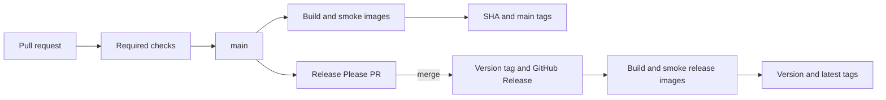

# Release and container process

FitTrack uses protected pull requests for source changes, publishes verified container images from `main`, and uses Release Please for versions, changelog entries, tags, and GitHub Releases. Product tags use the canonical `vMAJOR.MINOR.PATCH` format, for example `v0.0.1`; the component name is never included in a tag.

## Pipeline overview


```mermaid
flowchart LR
    Change[Pull request] --> Checks[Required checks]
    Checks --> Main[main]
    Main --> RP[Release Please PR]
    Main --> Images[Build and smoke images]
    Images --> MainTags[SHA and main tags]
    RP -->|merge| Release[Version tag and GitHub Release]
    Release --> ReleaseImages[Build and smoke release images]
    ReleaseImages --> VersionTags[Version and latest tags]
```

Every pull request runs the complete quality gate. A push to `main` has two independent effects:

- Release Please creates or updates one release pull request from Conventional Commits;
- after the `Test` workflow succeeds for a source or configuration change, the image workflow builds all three production images, publishes all three images to GHCR, smoke-tests their exact digests, and publishes the GHCR `main` tags. Markdown-only pushes do not rebuild images.

Merging the Release Please pull request is the explicit release action. Release Please then creates the `vMAJOR.MINOR.PATCH` tag and GitHub Release. The tag starts the release-image workflow, which waits for successful main image publication for the exact tagged commit, resolves its `sha-<commit>` image digests, smoke-tests them, and copies backend and migration OCI indexes to ECR under the version tag without rebuilding. Only after both ECR digests are verified does it publish the version and `latest` tags in GHCR.

## Protected main workflow

Normal changes use a short-lived branch and pull request:

```bash
git switch main
git pull --ff-only
git switch -c feat/workout-pagination

# Make and verify the change.
npm run verify

git add -- <changed-files>
git commit -m "feat: add workout pagination"
git push -u origin feat/workout-pagination
gh pr create --base main
```

Later corrections stay on the same branch and pull request. Push the additional commits and wait for the new checks.

The `main` ruleset requires:

- a pull request that is current with `main`;
- resolved review conversations;
- `Actions lint`, `Dependency review`, `Verify`, `Integration`, `Browser E2E`, and `Production container smoke`;
- the separate CodeQL code-scanning rule;
- rebase merges only;
- no force pushes or deletion of `main`.

Release Please pull requests use the same merge gate. Review the proposed version and changelog, and merge only when publishing a release is intentional. Opening, updating, or closing the pull request publishes nothing.

## Pull request scope and description

Give each human-authored pull request one reviewable outcome. Include the contracts, application layers, migration, tests, configuration, and documentation needed to deliver that outcome together. Put independent fixes, dependency updates, and release-process changes in separate pull requests. If a planned baseline or milestone needs a broad PR, explain why its parts belong together and how each was verified.

Use a scope-free Conventional Commit subject with a concise imperative summary for human-authored commits and PR titles. Choose the type for the substantive change: `feat:` for new behavior, `fix:` for corrected behavior, `perf:` for performance, `refactor:` for internal restructuring without behavior change, `test:` for tests, `docs:` for documentation, `ci:` for CI, `build:` for build or dependency changes, and `chore:` for other maintenance. Do not use a generic `chore:` title for a PR whose main outcome is a feature or fix. A PR may contain commits of different types when they all serve its outcome; Release Please reads the commits to determine the release proposal.

The [pull request template](../.github/PULL_REQUEST_TEMPLATE.md) prompts for:

- **Summary:** what changed and why, including the scope of a broad PR;
- **Validation:** exact checks run and their results, plus any required checks that failed or were not run with a reason;
- **Deployment or release impact:** migrations, environment or secret changes, image or runtime changes, rollout or rollback requirements, or `None`.

Keep the body current when the scope or validation changes. Dependabot and Release Please PRs retain their generated titles and descriptions; review their diffs and required checks under the same merge gate.

## Published images

| Image                 | Docker target | Purpose                                                  |
| --------------------- | ------------- | -------------------------------------------------------- |
| `fit-track-backend`   | `production`  | Compiled Express application and production dependencies |
| `fit-track-frontend`  | `production`  | Static React assets served by unprivileged Nginx         |
| `fit-track-migration` | `migration`   | Minimal Prisma CLI runtime and committed migrations      |

GitHub Actions builds all three images once on `main` and publishes them to GHCR: `ghcr.io/jakobzagar/<image-name>`. The release workflow copies backend and migration to ECR using GitHub OIDC, verifies their digests, and then promotes those exact images in GHCR. Frontend remains GHCR-only; AWS serves its static build from S3 and CloudFront. A successful GitHub-hosted run is required to verify AWS authentication and cross-registry publication. AWS authentication requirements and rollout commands belong in [AWS deployment](aws-deployment.md#deployment-procedure).

Published backend, migration, and frontend images target only `linux/amd64`, matching the `X86_64` ECS task definitions and x86 EC2 capacity. Builds retain SBOM and provenance attestations and use `pull: true` to resolve the current base images while retaining layer caches. Both image workflows run on x86 GitHub runners and do not configure QEMU. Local Docker builds still use the host platform unless explicitly overridden; running published images on ARM hosts requires AMD64 emulation.

Successful `main` builds publish:

- `sha-<commit>`;
- `main` in GHCR.

ECR receives only release version tags, such as `0.2.0`; main publication does not access AWS. Release copying preserves the complete OCI index, including SBOM and provenance manifests, and verifies the destination digest against its GHCR source. Existing ECR version tags are accepted only when their digest matches, making retries safe without replacing immutable tags. Digest references are recorded in the run summary and step outputs. GHCR release promotion runs only after both ECR copies succeed. Registry publication is not transactional: a failed copy can leave one ECR image published, and a failed GHCR promotion can leave some tags updated. Rerun the same release workflow to complete publication; matching immutable tags are reused, and conflicting version tags fail. The GitHub Release created by Release Please is not rolled back by an image-publication failure.

Successful releases additionally publish:

- the exact version without the `v` prefix, for example `0.2.0`;
- `latest`.

Workflows smoke-test exact source image digests before applying moving tags. Deployments and migrations should use digests; `main` and `latest` are convenience tags that move.

After image publication, the release workflow runs a separate production backend deployment job. It updates the migration digest through CloudFormation, requires a successful migration task, then updates the backend digest and verifies the requested ECS revision. General infrastructure changes and frontend S3 publication remain manual. IAM setup, parameter preservation, retry behavior, and deployment verification limits belong in [AWS deployment](aws-deployment.md#release-backend-cd); container validation belongs in the [testing guide](testing.md).

## Migration ordering

Deploy each schema and application change in this order:

1. build the migration, backend, and frontend images from the same revision;
2. smoke-test the exact image digests;
3. run the migration image once with the target database connection;
4. require a successful migration exit;
5. deploy the matching backend and frontend digests for the container deployment; the hosted AWS frontend instead publishes the matching static build to S3;
6. confirm backend readiness before routing traffic.

Backend replicas never run migrations during startup. Changes that cannot tolerate old and new application revisions at the same time require an expand-and-contract migration across separate releases.

## Release Please

Release Please treats the monorepo as one versioned product. Conventional Commit types drive the proposed version:

- `fix:` and `perf:` propose a patch;
- `feat:` proposes a minor;
- `!` or a `BREAKING CHANGE` footer proposes a major;
- `build:`, `chore:`, `ci:`, `docs:`, `refactor:`, and `test:` do not by themselves propose a release.

The release pull request coordinates the root, backend, frontend, and shared package versions. Release Please owns the product versions, root lockfile entries, manifest, changelog, version tag, and GitHub Release. Do not edit those release artifacts manually during ordinary development.

The recorded initial release is `v0.0.1`. The manifest records `0.0.1`, and subsequent proposals follow Conventional Commits normally. Release Please omits the component from Git tags so the tag consumed by the release-image workflow remains `vMAJOR.MINOR.PATCH`.

Configure `RELEASE_PLEASE_TOKEN` as a fine-grained repository token with read/write access to contents, pull requests, and issues. This token allows Release Please-created pull requests and tags to trigger the repository workflows.

Before promoting release images, `scripts/release/validate.sh` requires the exact `vMAJOR.MINOR.PATCH` tag format and matching package, lockfile, and Release Please manifest versions. After the exact source digests pass the production smoke test, `scripts/release/promote-images.sh` accepts only digest references and refuses to move an existing version tag to different content. `scripts/release/wait-for-images.sh` waits for the exact commit publication and resolves GHCR digests; `scripts/release/copy-images-to-ecr.sh` copies and verifies the ECR indexes. The workflow owns registry authentication, environment configuration, and step order. `npm run test:release-tools` covers validation, polling failures and timeouts, digest resolution, ECR copy failures and retries, and immutable promotion rules, including alignment between the Release Please tag configuration and release workflow trigger.

## Workflow validation

Changes to GitHub Actions or local actions require:

```bash
npm run actions:lint
```

They must also pass the repository's required pull-request checks. See the [testing guide](testing.md) for the complete validation matrix.

The release workflow waits up to 30 minutes for successful main publication of the exact release commit and fails if that run fails, is cancelled, or does not finish in time. It never substitutes the moving `main` tag or images from an older commit. If the matching build was skipped or cancelled, rerun the main publication for that revision before retrying the release workflow.
